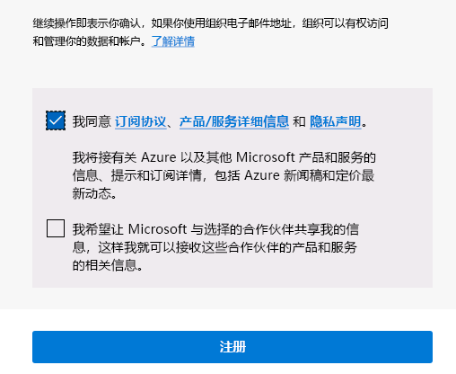

---
lab:
  title: 00 - 实验室设置
  learning path: '01'
  module: Module 01 - Implement an identity management solution
---

# 实验室 00：实验室环境设置

## 实验室场景

你需要创建一个新的 Azure 订阅并请求 Azure AD P2 许可证，以准备好完成即将开始的实验室。

#### 预计用时：5 分钟

## 创建 Azure 帐户并添加 Azure Active Directory Premium P2 试用版许可证

此练习中的任务和本学习路径中的练习要求你已拥有可使用的 Azure 订阅，或注册 Azure 试用帐户。 如果已有自己的 Azure 订阅，则可以跳过此任务并继续下一步。

1. 在 Web 浏览器中，转到 https://azure.microsoft.com/free。

1. 向下滚动页面，详细了解可用的权益和免费服务。

1. 选择“免费开始”。

1. 使用该向导注册 Azure 试用版订阅。

1. 需要 Azure AD P2 许可证才能完成某些练习。 在所创建的组织中，搜索并选择“Azure Active Directory”。

1. 在左侧导航菜单中，选择“开始”。

1. 在“Azure AD 入门”下，选择“获取 Azure AD Premium 的免费试用版”。

1. 在“激活”窗格中的“AZURE AD PREMIUM P2”下，选择“免费试用版”，然后选择“激活”。

1. 在左侧的导航菜单中，选择“概述”。

1. 刷新浏览器，直到组织名称下显示“Azure AD Premium P2”。 这可能需要几分钟的时间。

1. 如果遇到预期功能不可用的任何问题，则可能需要注销并重新登录 Microsoft Azure。

#### 兑换 Azure Pass

1. 打开浏览器并导航到： [www.microsoftazurepass.com](https://www.microsoftazurepass.com)。

1. 建议关闭所有浏览器，然后打开新的私密模式浏览器会话。 在激活步骤中，其他登录可能会一直保持并导致错误。

1. 选择“开始”按钮，以开始操作。

1. 验证用户名是否与实验室提供商租户帐户相同。

1. 在“输入促销代码”字段中输入 Azure Pass 优惠券代码。 如果请求，请进行人工验证。 

1. 在“配置文件”字段中输入地址信息。
    - **地址行 1**：1 Microsoft Way
    - 城市：Redmond
    - **状态**：华盛顿州
    - **邮编**：98052

1. 选中该框以同意订阅协议，然后选择“注册”。

    

1. 浏览到 [https://portal.azure.com](https://portal.azure.com)，使用目录的全局管理员帐户登录。

1. 导航到“订阅”并验证“Azure Pass - 赞助”是否显示“活动”状态  。 
