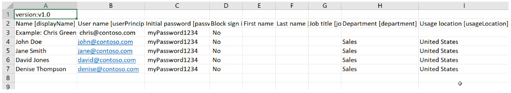

---
lab:
  title: 01 - 管理用户角色
  learning path: '01'
  module: Module 01 - Implement an Identity Management Solution
---

# WWL 租户 - 使用条款

如果在讲师引导式培训过程中向你提供租户，请注意，提供租户旨在支持讲师引导式培训中的交互式实验室。 租户不应共享或用于交互式实验室以外的用途。 本课程使用的租户为试用租户，课程结束后无法使用或访问，不符合扩展条件。 租户不得转换为付费订阅。 在本课程中获得的租户仍然是 Microsoft Corporation 的财产，我们保留随时获取访问权限和收回的权利。

# 两个不同的登录选项

此实验室有两个不同的登录选项，用于实验室的不同部分。 一种登录样式适用于需要 Azure 资源的实验室，另一种是仅需要 Microsoft Entra 和 Microsoft 365 资源的实验室。 日志类型：

  - 基于 Azure 资源的登录
  - Microsoft 365 + E5 租户登录

将告知你在每个实验室中使用的登录名。


# 实验室 01：管理用户角色

### 登录类型 = Microsoft 365 管理

## 实验室方案

你的公司最近雇佣了一名新员工担任应用程序管理员。 你需要创建一个新用户并分配合适的角色。

#### 预计用时：30 分钟

### 练习 1 - 创建新用户并测试他们的应用程序管理员权限

#### 任务 1 - 添加新用户

1. 以全局管理员身份登录  [https://entra.microsoft.com](https://entra.microsoft.com)  。
 - 使用 **Microsoft 365 管理**帐户。

2. 在左侧菜单中选择“**标识**”。

3. 在左侧导航菜单中的“用户”**** 下，选择“所有用户”****，然后选择“+ 新建用户”**** 和“创建新用户”****。

4. 标记“创建用户”按钮。 然后使用以下信息创建用户：

    | **设置**| **值**|
    | :--- | :--- |
    | 用户主体名称| ChrisG|
    | 显示名称| Chris Green|

5. 标记“自动生成密码”选项。

6. 将生成的密码复制到一个你能记住的位置以备下一个任务使用。

     首次登录此帐户时必须更改密码

7. 选择“查看 + 创建”  。 然后，在查看屏幕中选择“创建”****。 现已创建用户并注册到你的组织。

#### 任务 2 - 登录并尝试创建应用

1. 启动一个新的 InPrivate 浏览器窗口。
2. 以 Chris Green 的身份打开 Microsoft Entra 管理中心 [https://entra.microsoft.com](https://entra.microsoft.com)。

    | **设置**| **值**|
    | :--- | :--- |
    | 用户名| ChrisG@`your domain name.com`|
    | 密码| 输入上一个任务自动生成的密码。 |

3. 更新你的密码。

    | **设置**| **值**|
    | :--- | :--- |
    | 当前密码| 使用自动生成的密码|
    | 新密码| 输入唯一且安全的密码 |
    | 确认密码| 重新输入唯一且安全的密码 |

4. 在屏幕顶部的搜索对话框中搜索并选择“企业应用程序”。

5. 选择“+ 新建应用程序”。 请注意，“+ 创建自己的应用程序”不可用。

6. 尝试选择一些其他设置，例如“**应用程序代理**”、“**用户设置**”等，查看 **Chris Green** 是否没有相关权限。

7. 选择右上角的“ChrisG”名称并注销。


### 练习 2 - 分配应用程序管理员角色并创建应用

#### 任务 1 - 为用户分配角色

使用 Microsoft Entra ID，可指定受限的管理员来管理权限较低的角色中的标识任务。 可出于以下目的分配管理员：添加或更改用户、分配管理角色、重置用户密码、管理用户许可证，以及管理域名。

1. 如果尚未以全局管理员角色登录，请打开 Microsoft Entra 管理中心并登录。
2. 导航到“标识”，然后选择“用户”页。
3. 选择菜单的“管理”部分下的“所有用户”****。
4. 选择“Chris Green”帐户。
5. 从“管理”菜单中选择“分配的角色”。
6. 选择“+ 添加分配”并标记 `Application administrator` 角色。
7. 选择“添加”

    

**备注** - 如果实验室环境已激活 Microsoft Entra ID 高级版 P2，则将启用 Privileged Identity Management (PIM)，你需要选择“下一步”**** 并为该用户分配永久角色。

9. 选择“刷新”**** 按钮。

备注：新分配的“应用程序管理员”角色将显示在用户的“分配的角色”页中。

#### 任务 2 - 检查应用程序权限

1. 启动一个新的 InPrivate 浏览器窗口。
2. 以 Chris Green 的身份打开 Microsoft Entra 管理中心 [https://entra.microsoftcom](https://entra.microsoft.com)。

    | **设置**| **值**|
    | :--- | :--- |
    | 用户名| ChrisG@`your domain name.com`|
    | 密码| 输入之前创建的唯一安全密码 |

3. 如果看到“欢迎使用 Microsoft Azure”导览对话框，请选择“以后再说”按钮 。
4. 在屏幕顶部的搜索对话框中搜索并选择“企业应用程序”。
5. 请注意，现在可以使用“+ 新建应用程序”。
6. 选择“+ 新建应用程序”
7. 你会看到“+ 创建自己的应用程序”**** 不再以灰色显示。如果选择库应用，将看到“创建”**** 按钮可用。

   备注：此角色现在能够向租户添加应用程序。我们将在以后的实验室中更多地试用该功能。

7. 退出登录门户中的 Chris Green 实例并关闭浏览器。

### 练习 3 - 删除角色分配

#### 任务 1 - 从 Chris Green 中删除应用程序管理员

此任务将使用替代方法移除已分配的角色；它将使用 Microsoft Entra ID 中的“角色和管理员”选项。****

1. 如果尚未以全局管理员身份登录，请启动 Microsoft Entra 管理中心并立即登录。
2. 在搜索框中键入“角色”****，然后启动 Microsoft Entra ID 角色和管理。
3. 在“角色和管理员” **** 的“所有角色” **** 中，从列表中选择“应用程序管理员”**** 角色。
4. “应用程序管理员 | 分配”页面应会列出 Chris Green 的姓名。
5. 勾选 Chris Green 旁边的框。
6. 从对话框顶部的选项中选择“X 删除分配”。
7. 当确认框打开时回答“是”。
8. 关闭屏幕。

### 练习 4 - 批量导入用户

#### 任务 1 - 使用 .csv 文件创建用户的批量操作

1. 在 Microsoft Entra ID 菜单中，首先打开“标识”****，再选择“用户”****，然后选择“所有用户”****。

2. 在“用户 | 所有用户”磁贴上，选择“批量操作”下拉箭头，然后选择“批量创建”  。

3. 选择“批量创建”将打开一个新磁贴。 此磁贴提供了一个指向模板文件的下载链接，你将对其进行编辑以填充用户信息并上传以添加批量创建用户。

4. 选择“下载”以下载 .csv 文件。

5. .csv 模板为你提供包含在用户配置文件中的字段。 这包括所需的用户名、显示名称和初始密码。 此时，你还可以填写可选字段，例如部门和使用位置。 以下屏幕截图演示了如何完成 .csv 文件： 

    

    可修改此文件以批量添加用户。  请注意，无需填写所有字段。  根据提供的示例数据，你主要需要添加名称和用户名信息。

6. Allfiles/Lab1 文件夹中提供了一个示例 CSV -- SC300BulkUser.csv。
   1. 打开记事本。
     - 在实验室环境中，选择“开始”按钮，然后键入“记事本”。  
   1. 打开 SC300BulkUser.csv 文件
   1. 将“输入域名”更改为 Azure 实验室环境的域。
   1. 保存该文件。

7. 在“批量创建用户”对话框中，选择步骤 3

8. “Allfiles/Lab1 文件夹路径”上的文件夹图标，然后选择 SC300BulkUser.csv 文件。

9. 选择“打开”  。

7. 系统会通知你已成功上传文件。选择“提交”以添加用户。 

创建用户后，系统会提示你已成功创建。  关闭批量创建用户磁贴，新用户将填充到“用户 | 所有用户”列表。 

#### 任务 2 - 使用 PowerShell 批量添加用户

1. 以管理员身份打开 PowerShell。这可以通过在 Windows 中搜索 PowerShell 并选择“以管理员身份运行”来完成。 

**备注** - 此实验室需要具有 PowerShell 版本 7.2 或更高版本才能正常运行。  当 PowerShell 打开时，将在屏幕顶部显示版本号，如果正在运行旧版本，请按照屏幕上的说明转到 https://aka.ms/PowerShell-Release?tag=7.3.9。 向下滚动到“资产”部分，然后选择“powershell-7.3.1-win-x64.msi”。 下载完成后，选择“打开文件”。 使用所有默认值进行安装。

2. 如果以前未使用过 Microsoft.Graph PowerShell 模块，则需要安装该模块。  运行以下两个命令，并在系统提示确认时按 Y：

    ```
    Install-Module Microsoft.Graph
    ```
3. 确认已安装 Microsoft.Graph 模块：

    ```
    Get-InstalledModule Microsoft.Graph
    ```
    

4. 接下来，需要通过运行以下命令登录到 Azure：  

    ```
    Connect-MgGraph -Scopes "User.ReadWrite.All"
    ``` 
    Edge 浏览器将打开，系统会提示你登录。  使用 MOD 管理员帐户进行连接。  接受权限请求，然后关闭浏览器窗口。

5. 若要验证是否已连接并查看现有用户，请运行：  

    ``` 
    Get-MgUser 
    ```
    
7. 若要向所有新用户分配一个通用临时密码，请运行以下命令，并将 <Enter a complex Password> 替换为要提供给用户的密码。  

    ``` 
    $PWProfile = @{
        Password = "<Enter a complex password you will>";
        ForceChangePasswordNextSignIn = $false
    }
    ```

8. 现在便可以创建新用户了。  以下命令将填充用户信息并运行。  如果要添加多个用户，可以使用记事本 txt 文件添加用户信息并将其复制/粘贴到 PowerShell 中。 

    ```
    New-MgUser `
        -DisplayName "New PW User" `
        -GivenName "New" -Surname "User" `
        -MailNickname "newuser" `
        -UsageLocation "US" `
        -UserPrincipalName "newuser@<labtenantname.com>" `
        -PasswordProfile $PWProfile -AccountEnabled `
        -Department "Research" -JobTitle "Trainer"
    ```
注意 - 将 labtenantname.com 替换为实验室租户分配的 onmicrosoft.com 名称  。

## 试验管理用户

可以使用 Microsoft Entra ID 页添加和删除用户。  而使用脚本可以创建用户和分配角色。  试验使用脚本为 Chris Green 用户帐户分配不同的角色。 
 

### 练习 5 - 从 Microsoft Entra ID 中删除用户

#### 任务 1 - 删除用户

可能出现已删除帐户，然后需要恢复此帐户的情况。 你需要验证是否可以恢复最近已删除的帐户。

1. 浏览到 [https://entra.micrososft.com](Microsoft Entra admin center)。

2. 在左侧导航栏的“标识”下，选择“用户”。********

3. 打开“所有用户”**** 列表，选中与要删除的用户对应的复选框。 例如，选择“Chris Green”。

    提示 - 通过从列表中选择用户可以同时管理多个用户。 如果选择某个用户，打开该用户的页面后，你将只能管理这一个用户。

    

4. 选中用户帐户后，在菜单上选择“删除”。

5. 查看对话框，然后选择“是”。

#### 任务 2 - 还原已删除的用户

1. 在“用户”页中，选择左侧导航栏的“所有用户”****，选择“已删除的用户”****。

2. 查看已删除的用户列表，然后选择“Chris Green”。

    重要说明 - 默认情况下，已删除的用户帐户会在 30 天后自动从 Azure Active Directory 中永久删除。

3. 在菜单上，选择“还原用户”。

4. 查看对话框，然后选择“确定”。

5. 在左侧导航栏中，选择“所有用户”。

6. 验证用户是否已还原。


### 练习 6 - 向用户帐户添加 Windows 10 许可证

#### 任务 1 - 在 Azure Active Directory 中查找未获许可的用户

组织中的一些用户帐户将不会获得其分配的许可证中的所有可用产品，或者将需要更新或补充其许可证分配。 需要确保能够在 Microsoft Entra ID 中更新用户帐户的许可证分配。

1. 浏览到 [https://entra.microsoft.com]( https://entra.microsoft.com)。

2. 在左侧导航栏中的“标识”**** 下，选择“用户”****，然后选择“所有用户”****。

3. 在“用户”页的搜索框中输入“Raul”。

4. 选择“Raul Razo”。

5. 查看 Raul 的个人资料并确保他设置了“使用位置”。

    警告 - 若要将许可证分配给某个用户，该用户必须分配有使用位置。

6. 选择左侧菜单中的“**许可证**”菜单项。

7. 确保 Raul 的状态为“未找到许可证分配”。

#### 任务 2 - 将 Windows 许可证添加到 Raul

必须通过 Microsoft 365 管理中心添加和删除许可证。 这是一个相对较新的变化。

1. 在浏览器中打开新的标签页。

2. 连接到 Microsoft Entra 管理中心 (http://admin.microsoft.com)。

3. 如果系统提示，请以管理员帐户身份登录。

4. 从左侧菜单中，选择“**计费**”，然后选择“**许可证**”。

5. 从列表中选择 **Windows 10/11 企业版 E3** 许可证。

6. 选择“**+ 添加许可证**”项。

7. 在列表中搜索 **Raul Razo**。

8. 添加 Raul 后，选择“**分配**”。

9. 返回到打开了 **Microsoft Entra 管理中心**的浏览器标签页。

10. 导航回到左侧导航栏中的“所有用户”****，在“标识”**** 下，选择“用户”****

11. 在“用户”页上，选择“Raul Razo”。

12. 在左侧导航栏中，选择“许可证”。

13. 请注意，许可证已分配。

14. 你可以退出许可证屏幕。
