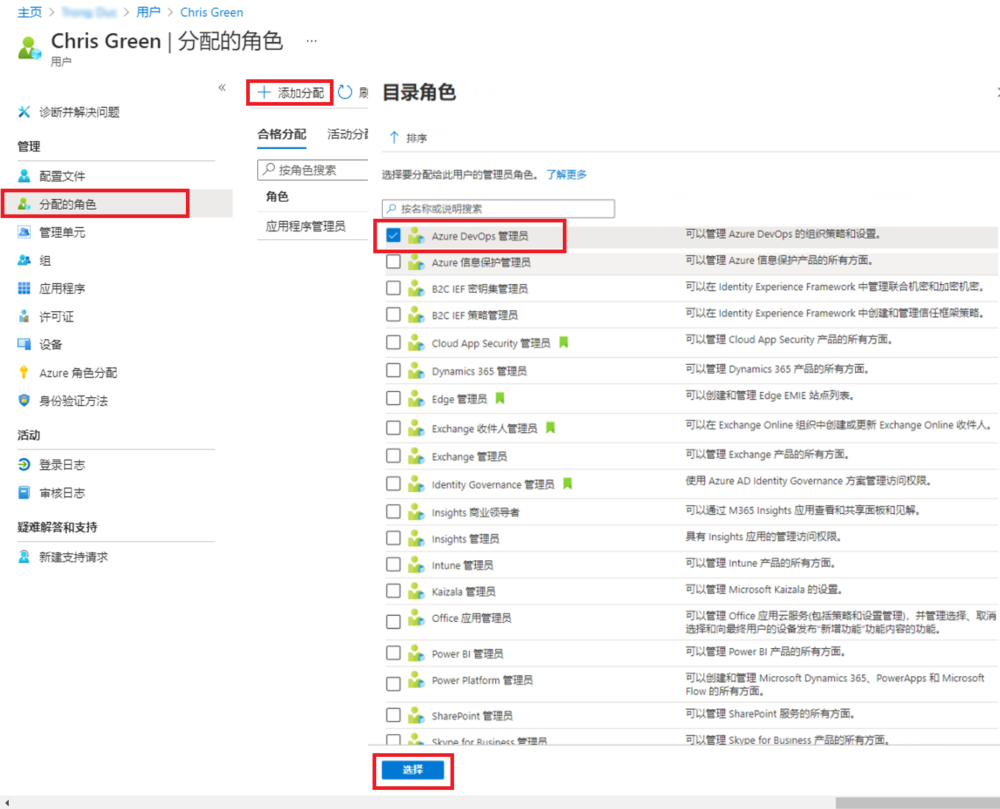

---
lab:
  title: 01 - 管理用户角色
  learning path: "01"
  module: Module 01 - Implement an Identity Management Solution
ms.openlocfilehash: 7c31d8992e13421f54ef67bfd8e7bd833e68eae4
ms.sourcegitcommit: 448f935ad266989a6f0086019e0c0e0785ad162b
ms.translationtype: HT
ms.contentlocale: zh-CN
ms.lasthandoff: 02/10/2022
ms.locfileid: "138421375"
---
# 实验室 01：管理用户角色

## 实验室方案

你的公司最近雇佣了一名新员工担任应用程序管理员。 你需要创建一个新用户并分配合适的角色。

#### 预计用时：10 分钟

### 练习 1 - 创建新用户并测试他们的应用程序管理员权限

#### 任务 1 - 添加新用户

1. 以全局管理员身份登录 [https://portal.azure.com](https://portal.azure.com)

2. 搜索并选择“Azure Active Directory”。

3. 在左侧导航菜单的“管理”下，选择“用户”>“+ 新建用户” 。

4. 确保选择了“创建用户”。  使用以下信息创建用户：

    | **设置**| **值**|
    | :--- | :--- |
    | 用户名| ChrisG|
    | 名称| Chris Green|
    | 名字| Chris|
    | 姓氏| 绿色|

5. 标记“创建密码”

6. 使用密码 = Pass@word1

     首次登录此帐户时必须更改密码

7. 选择“创建”。 现已创建用户并注册到你的组织。

#### 任务 2 - 登录并尝试创建应用

1. 启动一个新的 InPrivate 浏览器窗口。
2. 以 Chris Green 身份打开 Azure 门户 [https://portal.azure.com](https://portal.azure.com)。

    | 设置| **值**|
    | :--- | :--- |
    | 用户名| ChrisG@`your domain name.com`|
    | 密码| Pass@word1|

3. 更新你的密码。

    | 设置| **值**|
    | :--- | :--- |
    | 当前密码| Pass@word1|
    | 新密码| Pa$$w.rd1234|
    | 确认密码| Pa$$w.rd1234|

4. 如果看到“欢迎使用 Microsoft Azure”导览对话框，请单击“以后再说”按钮 。

5. 在屏幕顶部的搜索对话框中搜索并选择“企业应用程序”。
6. 单击“+ 新建应用程序”。 请注意，“+ 创建自己的应用程序”不可用。
7. 尝试单击一些其他设置，例如“应用程序代理”、“用户设置”等等，以了解 Chris Green 没有相关权限  。
8. 单击右上角的“ChrisG”名称并注销。

### 练习 2 - 分配应用程序管理员角色并创建应用

#### 任务 1 - 为用户分配角色

使用 Azure Active Directory (Azure AD) 时，可以指定有限的管理员以权限较低的角色来管理标识任务。 可出于以下目的分配管理员：添加或更改用户、分配管理角色、重置用户密码、管理用户许可证，以及管理域名。

1. 如果尚未以全局管理员角色登录，请打开 Azure 门户并登录。
2. 导航到“Azure Active Directory”边栏选项卡。
3. 单击菜单“管理”部分下的“用户”。
4. 单击“Chris Green”帐户。
5. 从“管理”菜单中选择“分配的角色”。
6. 单击“+ 添加分配”并标记 `Application administrator` 角色。
7. 单击“添加”

    

8. 单击“刷新”按钮。

   备注：新分配的“应用程序管理员”角色将显示在用户的“分配的角色”页中。

#### 任务 2 - 检查应用程序权限

1. 启动一个新的 InPrivate 浏览器窗口。
2. 以 Chris Green 身份打开 Azure 门户 [https://portal.azure.com](https://portal.azure.com)。

    | 设置| **值**|
    | :--- | :--- |
    | 用户名| ChrisG@`your domain name.com`|
    | 密码| Pa$$w.rd1234|

3. 如果看到“欢迎使用 Microsoft Azure”导览对话框，请单击“以后再说”按钮 。
4. 在屏幕顶部的搜索对话框中搜索并选择“企业应用程序”。
5. 请注意，现在可以使用“+ 新建应用程序”。
6. 单击“+ 新建应用程序”

   备注：此角色现在能够向租户添加应用程序。我们将在以后的实验室中更多地试用该功能。

7. 注销 Azure 门户中的 Chris Green 实例并关闭浏览器。

### 练习 3 - 删除角色分配

#### 任务 1 - 从 Chris Green 中删除应用程序管理员

此任务将使用替代方法删除分配的角色；它将使用 Azure AD 中的“角色和管理员”选项。

1. 如果尚未以全局管理员身份登录，请启动 Azure 门户并立即登录。
2. 在搜索框中键入“Azure Active Directory”并启动 Azure AD。
3. 在 Azure Active Directory 中，选择“角色和管理员”，然后从列表中选择“应用程序管理员”角色  。

   备注：此时可以选择多个角色来执行一些批处理活动。

4. “应用程序管理员 | 分配”页面应会列出 Chris Green 的姓名。
5. 勾选 Chris Green 旁边的框。
6. 从对话框顶部的选项中单击“X 删除分配”。
7. 当确认框打开时回答“是”。
8. 关闭 Azure Active Directory。

## 试验管理用户

通过“Azure AD”边栏选项卡可以添加和删除用户。  而使用脚本可以创建用户和分配角色。  试验使用脚本为 Chris Green 用户帐户分配不同的角色。
