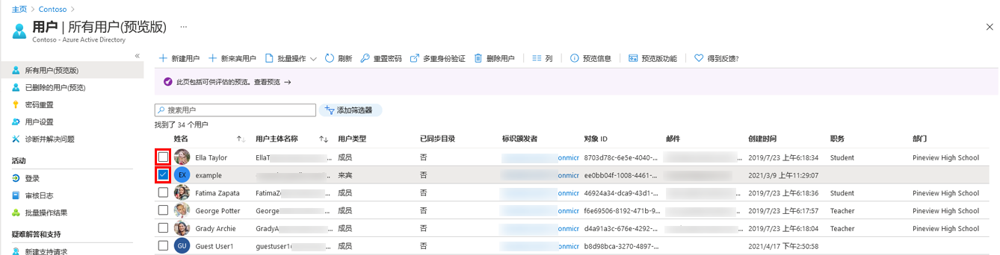

---
lab:
  title: 01 - 管理用户角色
  learning path: "01"
  module: Module 01 - Implement an Identity Management Solution
ms.openlocfilehash: 2f0c349fe65316fd9a3166d81603b2b88af20a8f
ms.sourcegitcommit: bc5c47a39782e94c249ec4bce01ba0da9249ec61
ms.translationtype: HT
ms.contentlocale: zh-CN
ms.lasthandoff: 07/01/2022
ms.locfileid: "146822633"
---
# <a name="lab-01-manage-user-roles"></a>实验室 01：管理用户角色

## <a name="lab-scenario"></a>实验室方案

你的公司最近雇佣了一名新员工担任应用程序管理员。 你需要创建一个新用户并分配合适的角色。

#### <a name="estimated-time-30-minutes"></a>预计用时：30 分钟

### <a name="exercise-1---create-a-new-user-and-test-their-application-admin-rights"></a>练习 1 - 创建新用户并测试他们的应用程序管理员权限

#### <a name="task-1---add-a-new-user"></a>任务 1 - 添加新用户

1. 以全局管理员身份登录 [https://portal.azure.com](https://portal.azure.com)

2. 搜索并选择“Azure Active Directory”。

3. 在左侧导航菜单中的“管理”下，选择“用户”，然后选择“+ 新建用户”  。

4. 确保选择了“创建用户”。  使用以下信息创建用户：

    | **设置**| **值**|
    | :--- | :--- |
    | 用户名| ChrisG|
    | 名称| Chris Green|
    | 名字| Chris|
    | 姓氏| 绿色|

5. 标记“创建密码”

6. 使用密码 - 输入一个你能记住的安全密码。

     首次登录此帐户时必须更改密码

7. 选择“创建”。 现已创建用户并注册到你的组织。

#### <a name="task-2---login-and-try-to-create-an-app"></a>任务 2 - 登录并尝试创建应用

1. 启动一个新的 InPrivate 浏览器窗口。
2. 以 Chris Green 身份打开 Azure 门户 [https://portal.azure.com](https://portal.azure.com)。

    | 设置| **值**|
    | :--- | :--- |
    | 用户名| ChrisG@`your domain name.com`|
    | 密码| Pass@word1|

3. 更新你的密码。

    | 设置| **值**|
    | :--- | :--- |
    | 当前密码| Pass@word1|
    | 新密码| Pa$$w.rd1234|
    | 确认密码| Pa$$w.rd1234|

4. 如果看到“欢迎使用 Microsoft Azure”导览对话框，请选择“以后再说”按钮 。

5. 在屏幕顶部的搜索对话框中搜索并选择“企业应用程序”。
7. 选择“+ 新建应用程序”。 请注意，“+ 创建自己的应用程序”不可用。

9. 尝试选择一些其他设置，例如“应用程序代理”、“用户设置”等等，以了解 Chris Green 没有相关权限  。
10. 选择右上角的“ChrisG”名称并注销。


### <a name="exercise-2---assign-the-application-admin-role-and-create-an-app"></a>练习 2 - 分配应用程序管理员角色并创建应用

#### <a name="task-1---assign-a-role-to-a-user"></a>任务 1 - 为用户分配角色

使用 Azure Active Directory (Azure AD) 时，可以指定有限的管理员以权限较低的角色来管理标识任务。 可出于以下目的分配管理员：添加或更改用户、分配管理角色、重置用户密码、管理用户许可证，以及管理域名。

1. 如果尚未以全局管理员角色登录，请打开 Azure 门户并登录。
2. 导航到 Azure Active Directory 页面。
3. 选择菜单“管理”部分下的“用户”。
4. 选择“Chris Green”帐户。
5. 从“管理”菜单中选择“分配的角色”。
6. 选择“+ 添加分配”并标记 `Application administrator` 角色。
7. 选择“添加”

    

注意 - 如果实验室环境已激活 Azure AD Premium P2，则将启用 Privileged Identity Management (PIM)，你需要选择“下一步”并为该用户分配永久角色 。

8. 选择“刷新”按钮。

备注：新分配的“应用程序管理员”角色将显示在用户的“分配的角色”页中。

#### <a name="task-2---check-application-permissions"></a>任务 2 - 检查应用程序权限

1. 启动一个新的 InPrivate 浏览器窗口。
2. 以 Chris Green 身份打开 Azure 门户 [https://portal.azure.com](https://portal.azure.com)。

    | 设置| **值**|
    | :--- | :--- |
    | 用户名| ChrisG@`your domain name.com`|
    | 密码| Pa$$w.rd1234|

3. 如果看到“欢迎使用 Microsoft Azure”导览对话框，请选择“以后再说”按钮 。
4. 在屏幕顶部的搜索对话框中搜索并选择“企业应用程序”。
5. 请注意，现在可以使用“+ 新建应用程序”。
6. 选择“+ 新建应用程序”

   备注：此角色现在能够向租户添加应用程序。我们将在以后的实验室中更多地试用该功能。

7. 注销 Azure 门户中的 Chris Green 实例并关闭浏览器。

### <a name="exercise-3---remove-a-role-assignment"></a>练习 3 - 删除角色分配

#### <a name="task-1---remove-the-application-administrator-from-chris-green"></a>任务 1 - 从 Chris Green 中删除应用程序管理员

此任务将使用替代方法删除分配的角色；它将使用 Azure AD 中的“角色和管理员”选项。

1. 如果尚未以全局管理员身份登录，请启动 Azure 门户并立即登录。
2. 在搜索框中键入“Azure Active Directory”并启动 Azure AD。
3. 在 Azure Active Directory 中，选择“角色和管理员”，然后从列表中选择“应用程序管理员”角色  。

注意 - 如果实验室环境已激活 Azure AD Premium P2，则将启用 Privileged Identity Management (PIM)，你需要选择“下一步”并为该用户分配永久角色 。

4. “应用程序管理员 | 分配”页面应会列出 Chris Green 的姓名。
5. 勾选 Chris Green 旁边的框。
6. 从对话框顶部的选项中选择“X 删除分配”。
7. 当确认框打开时回答“是”。
8. 关闭 Azure Active Directory。

### <a name="exercise-4---bulk-import-of-users"></a>练习 4 - 批量导入用户

#### <a name="task-1---bulk-operations-for-creating-users-with-a-csv-file"></a>任务 1 - 使用 .csv 文件创建用户的批量操作

1. 在 Azure AD 菜单中，选择“管理”下的“用户” 。

2. 在“用户 | 所有用户”磁贴上，选择“批量操作”下拉箭头，然后选择“批量创建”  。

3. 选择“批量创建”将打开一个新磁贴。 此磁贴提供了一个指向模板文件的下载链接，你将对其进行编辑以填充用户信息并上传以添加批量创建用户。

4. 选择“下载”以下载 .csv 文件。

5. .csv 模板为你提供包含在用户配置文件中的字段。 这包括所需的用户名、显示名称和初始密码。 此时，你还可以填写可选字段，例如部门和使用位置。 以下屏幕截图演示了如何完成 .csv 文件： 

    

6. 填充后，保存更改并上传以添加用户。

7. 系统会通知你已成功上传文件。  选择“提交”以添加用户。 

创建用户后，系统会提示你已成功创建。  关闭批量创建用户磁贴，新用户将填充到“用户 | 所有用户”列表。 

#### <a name="task-2---bulk-addition-of-users-using-powershell"></a>任务 2 - 使用 PowerShell 批量添加用户

1. 以管理员身份打开 PowerShell。  这可以通过在 Windows 中搜索 PowerShell 并选择“以管理员身份运行”来完成。 

注意 - 选择 PowerShell 而不是 PowerShell ISE。

2. 如果以前未使用过 Azure AD PowerShell 模块，则需要添加它。  运行以下命令：Install-Module AzureAD。  出现提示时，选择“Y”继续。

    ```
    Install-Module AzureAD
    ```

3. 通过运行以下命令确认模块正确安装：  

    ```
    Get-Module AzureAD 
    ```

4. 接下来，需要通过运行以下命令登录到 Azure：  

    ```
    Connect-AzureAD 
    ``` 

5. 将显示 Microsoft 登录窗口，供你登录 Azure AD。  

6. 若要验证是否已连接并查看现有用户，请运行：  

    ``` 
    Get-AzureADUser 
    ```
    
7. 若要向所有新用户分配一个通用临时密码，请运行以下命令，并将 TempPW 替换为要提供给用户的密码。  

    ``` 
    $PasswordProfile = New-Object -TypeName Microsoft.Open.AzureAD.Model.PasswordProfile
    ```

    ```
    $PasswordProfile.Password = "Pass@word1" 
    ```

8. 现在便可以创建新用户了。  以下命令将填充用户信息并运行。  如果要添加多个用户，可以使用记事本 txt 文件添加用户信息并将其复制/粘贴到 PowerShell 中。 

    ```
    New-AzureADUser -DisplayName "New User" -PasswordProfile $PasswordProfile -UserPrincipalName "NewUser@labtenantname.com" -AccountEnabled $true -MailNickName "Newuser"
    ```
注意 - 将 labtenantname.com 替换为实验室租户分配的 onmicrosoft.com 名称  。

## <a name="experiment-with-managing-users"></a>试验管理用户

可以使用 Azure AD 页面添加和删除用户。  而使用脚本可以创建用户和分配角色。  试验使用脚本为 Chris Green 用户帐户分配不同的角色。 
 

### <a name="exercise-5---remove-a-user-from-azure-active-directory"></a>练习 5 - 从 Azure Active Directory 删除用户

#### <a name="task-1---remove-a-user"></a>任务 1 - 删除用户

可能出现已删除帐户，然后需要恢复此帐户的情况。 你需要验证是否可以恢复最近已删除的帐户。

1. 浏览到 [https://portal.azure.com/#blade/Microsoft_AAD_IAM/ActiveDirectoryMenuBlade/Overview]( https://portal.azure.com/#blade/Microsoft_AAD_IAM/ActiveDirectoryMenuBlade/Overview)。

2. 在左侧导航栏的“管理”下，选择“用户”。

3. 在“用户”列表中，选中要删除的用户对应的复选框。 例如，选择“Chris Green”。

    提示 - 通过从列表中选择用户可以同时管理多个用户。 如果选择某个用户，打开该用户的页面后，你将只能管理这一个用户。

    

4. 选中用户帐户后，在菜单上选择“删除”。

5. 查看对话框，然后选择“是”。

#### <a name="task-2---restore-a-deleted-user"></a>任务 2 - 还原已删除的用户

1. 在“用户”页面的左侧导航栏中，选择“已删除的用户”。

2. 查看已删除的用户列表，然后选择“Chris Green”。

    重要说明 - 默认情况下，已删除的用户帐户会在 30 天后自动从 Azure Active Directory 中永久删除。

3. 在菜单上，选择“还原用户”。

4. 查看对话框，然后选择“确定”。

5. 在左侧导航栏中，选择“所有用户”。

6. 验证用户是否已还原。


### <a name="exercise-6---add-a-windows-10-license-to-a-user-account"></a>练习 6 - 向用户帐户添加 Windows 10 许可证

#### <a name="task-1---find-your-unlicensed-user-in-azure-active-directory"></a>任务 1 - 在 Azure Active Directory 中查找未获许可的用户

组织中的一些用户帐户将不会获得其分配的许可证中的所有可用产品，或者将需要更新或补充其许可证分配。 你需要确保能够在 Azure AD 中更新用户帐户的许可证分配。

1. 浏览到 [https://portal.azure.com/#blade/Microsoft_AAD_IAM/ActiveDirectoryMenuBlade/Overview]( https://portal.azure.com/#blade/Microsoft_AAD_IAM/ActiveDirectoryMenuBlade/Overview)。

2. 在左侧导航栏的“管理”下，选择“用户”。 

3. 在“用户”页的搜索框中输入“Raul”。

4. 选择“Raul Razo”。

5. 查看 Raul 的个人资料并确保他设置了“使用位置”。

    警告 - 若要将许可证分配给某个用户，该用户必须分配有使用位置。

6. 选择左侧菜单中的“许可证”菜单项。

7. 确保 Raul 的状态为“未找到许可证分配”。

8. 浏览到 [https://portal.azure.com/#blade/Microsoft_AAD_IAM/ActiveDirectoryMenuBlade/Overview]( https://portal.azure.com/#blade/Microsoft_AAD_IAM/ActiveDirectoryMenuBlade/Overview)。

9. 在左侧导航栏的“管理”下，选择“用户” 

10. 在“用户”页上，选择“Raul Razo”。

11. 在左侧导航栏中，选择“许可证”。

12. 选择“+ 分配”按钮。 

13. 在“更新许可证分配”页上，选择“Windows 10/11 企业版 E3”许可证复选框。

    

14. 完成后选择“保存”。

15. 在屏幕顶部选择“主页”，然后依次选择“Contoso”、“用户”和“Raul Razo”   。

16. 请注意，许可证已分配。
