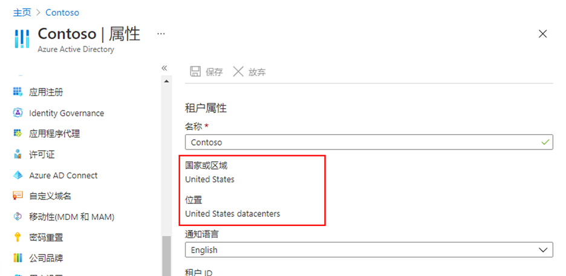
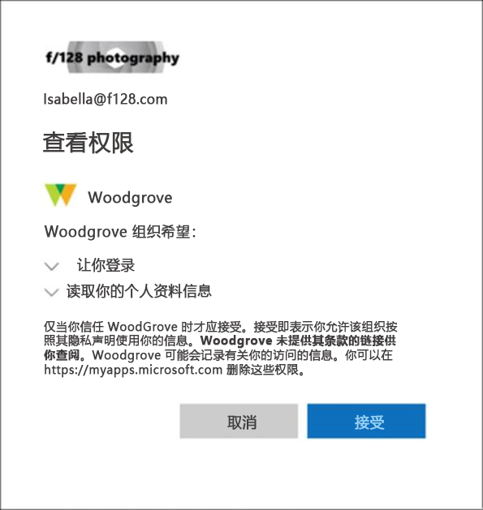

---
lab:
  title: 02 - 使用租户属性
  learning path: '01'
  module: Module 01 - Implement an Identity Management Solution
---

# 实验室 02：使用租户属性

### 登录类型 = Microsoft 365 + E5 租户登录

## 实验室方案

你需要标识和更新与你的租户关联的不同属性。

#### 预计用时：15 分钟

### 练习 1 - 创建自定义子域 

#### 任务 1 - 创建自定义子域名称

可以使用 Microsoft Entra ID 创建已购买的域。  如果要创建子域来划分现有的 .onmicrosoft.com 域，则必须使用 Microsoft 365 管理中心。

1. 浏览到 [https://entra.microsoft.com](https://entra.microsoft.com)，使用目录的全局管理员帐户登录。

1. 在“**标识**”菜单中，使用底部的“**显示更多**”选项。

1.  打开“设置”菜单，选择“域名”********。

1. 选择“+ 添加自定义域”。

1. 在“自定义域名”字段中，通过将 sales 放在 onmicrosoft.com 域名前面，为实验室租户创建一个自定义子域  。  格式如下所示：

    ```
    Sales.labTenantName.onmicrosoft.com
    ```

注意**** - 系统将提示你打开 Microsoft 365 管理中心以完成此操作。

1. 选择“添加域”以添加子域。

1. 在对话框中输入子域名称 `sales.tenantname.onmicrosoft.com`。 请记住将 *tenantname* 替换为租户名称。

1. 选择屏幕底部的“**使用此域**”按钮。

1. 在下一个屏幕打开时，选择“**关闭**”按钮。  在本实验室中，我们不会设置 DNS。

### 练习 2 - 更改租户显示名称

#### 任务 1 - 设置租户名称和技术联系人

1. 在 Microsoft Entra 管理中心内，打开“标识”**** 菜单。

1. 在左侧导航栏中，依次选择“概述”**** 菜单项和“属性”****。

1. 在对话框中更改“姓名”和“技术联系人”的租户属性 。

    | 设置 | **值** |
    | :--- | :--- |
    | 名称 | Contoso 市场营销 |
    | 技术联系人 | `your Global admin account` |

1. 选择“保存”以更新租户属性。

   保存完成后，你会立即发现名称已更改。

#### 任务 2 - 查看国家或地区以及与租户相关的其他值

1. 在“标识”**** 菜单中，选择“概述”****，然后选择“属性”****。

2. 在“租户属性”下，找到“国家或地区”，查看相关信息。

    重要提示 - 创建租户时将指定国家或地区。 稍后将无法更改此设置。

3. 在“属性”页的“租户属性”下，找到“位置”并查看相关信息  。

    

#### 任务 3 - 查找租户 ID

Azure 订阅与 Microsoft Entra ID 存在信任关系。 Microsoft Entra ID 是用于对订阅的用户、服务和设备进行身份验证的受信任服务。 每个订阅都有一个与之关联的租户 ID，可以通过几种方法查找订阅的租户 ID。

1. 打开“Microsoft Entra 管理中心”https://entra.microsoft.com[](https://entra.microsoft.com)

1. 在“标识”**** 菜单中，选择“概述”****，然后选择“属性”****。

1. 在“租户属性”下，找到“租户 ID”。 这是你的唯一租户标识符。

    

**备注** - 如果记录租户 ID 记事本或其他位置以供将来的实验室使用，则非常有用。

### 练习 3 - 设置隐私信息

#### 任务 1 - 在 Microsoft Entra ID 上添加隐私信息，包括全局隐私联系人和隐私声明 URL

Microsoft 强烈建议添加全局隐私联系人和组织的隐私声明，以便内部员工和外部来宾可以查看你的策略。 由于隐私声明是为每个企业唯一创建和定制的，我们强烈建议你与律师联系以获取帮助。

   备注 - 如需详细了解如何查看或删除个人数据，请参阅 [https://docs.microsoft.com/microsoft-365/compliance/gdpr-dsr-azure](https://docs.microsoft.com/microsoft-365/compliance/gdpr-dsr-azure)。 有关 GDPR 的详细信息，请参阅 [https://servicetrust.microsoft.com/ViewPage/GDPRGetStarted](https://servicetrust.microsoft.com/ViewPage/GDPRGetStarted)。

可以在 Microsoft Entra ID 的“属性” 区域中添加组织的隐私信息。 **** 访问“属性”区域并添加隐私信息：

1. 在“标识”**** 菜单中，选择“概述”****，然后选择“属性”****。

    

2. 为员工添加隐私信息：

- 全局隐私联系人 - `AllanD@` 你的 Azure 实验室域名
     - Allan Deyoung 是 Azure 实验室租户中的内置用户，担任 IT 管理员，我们将其作为隐私联系人。
     - 如果存在数据安全漏洞，此人同时也是 Microsoft 联系人。 如果此处未列出任何人，Microsoft 将联系全局管理员。

- 隐私声明 URL -  <https://github.com/MicrosoftLearning/SC-300-Identity-and-Access-Administrator/blob/master/Allfiles/Labs/Lab2/SC-300-Lab_ContosoPrivacySample.pdf>

     - 实验室目录中提供了示例隐私 PDF 文件。
     \- 键入指向组织文档的链接，该文档描述组织如何处理内部和外部来宾的数据隐私。

    重要提示 - 如果不加入自己的隐私声明或隐私联系人，外部来宾将在“查看权限”框中看到以下内容：<你的组织名称\> 未提供条款链接供你查看 **** 。 例如，来宾用户将在收到通过 B2B 协作访问组织的邀请时看到此消息。

    

3. 选择“保存”。

#### 任务 2 - 检查隐私声明

1. 返回 Azure 主屏幕 - 仪表板。
2. 在 UI 的右上角，选择用户名。
3. 从下拉菜单中选择“查看帐户”。

     此时会自动打开一个新的浏览器标签页。

4. 在左侧菜单中，选择“**设置和隐私**”。
5. 选择“隐私”。
6. 在“组织的通知”下，选择 Contoso 市场营销组织隐私声明旁边的“查看”项 。

     此时将打开一个新的浏览器标签页，其中显示链接指向的隐私 PDF 文件。

7. 查看示例隐私声明。
8. 关闭其中包含 PDF 文件的浏览器选项卡。
9. 关闭显示“我的帐户”项的浏览器选项卡。
