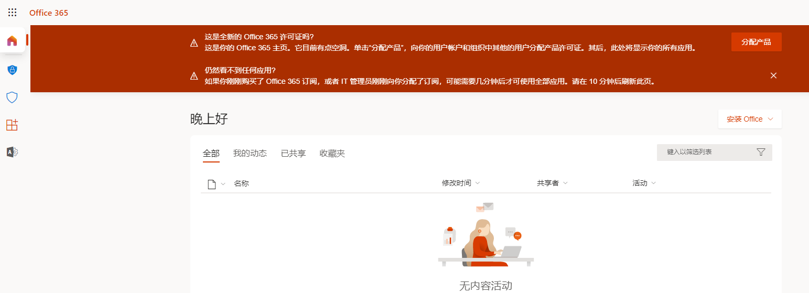
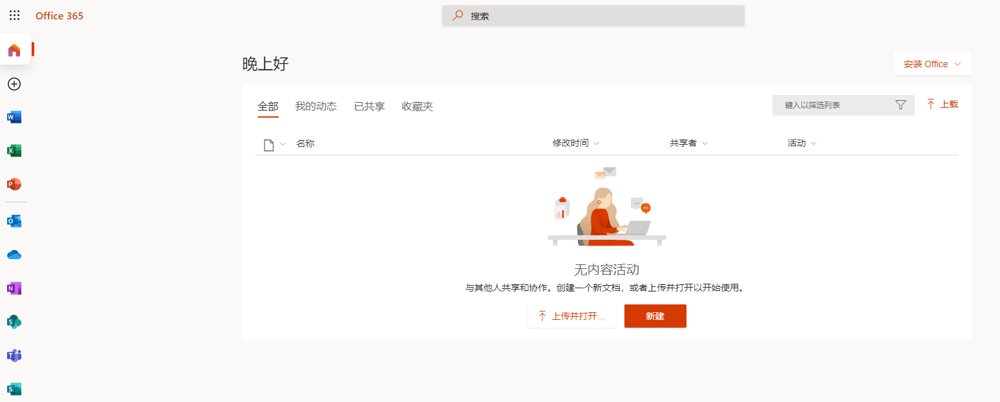
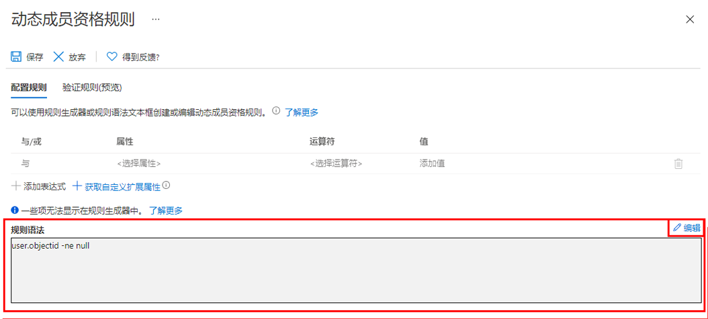

---
lab:
  title: 03 - 使用组成员身份分配许可证
  learning path: '01'
  module: Module 01 - Implement an identity management solution
---

# 实验室 03：使用组成员身份分配许可证

### 登录类型 = Microsoft 365 管理

## 实验室方案

你所在组织已决定使用 Microsoft Entra ID 中的安全组来管理许可证。 你需要配置新的安全组，向该组分配许可证，以及验证组成员许可证是否已更新。

#### 预计用时：25 分钟

### 练习 1 - 创建安全组并添加用户

#### 任务 1 - 检查 Delia Dennis 是否可以访问 Office 365

1. 启动一个新的 InPrivate 浏览器窗口。
2. 连接到 [https://www.office.com](https://www.office.com)。
3. 选择“登录”并以 Delia Dennis 的身份进行连接。

   | **设置**| **值**|
   | :--- | :--- |
   | 用户名 | DeliaD@`your domain name.com`|
   | 密码| 在“资源”中输入全局管理员的密码|

4. 你应会连接到 Office.com 网站，但会看到一条消息，该消息表示你没有许可证。

   
    
5. 关闭浏览器窗口。

#### 任务 2 - 在 Microsoft Entra ID 中创建安全组

1. 浏览到 [https://entra.microsoft.com](https://entra.microsoft.com)。

2. 在左侧导航栏的“标识”**** 下，选择“组”****，然后选择“所有组”****。
3. 在“组”页的菜单中，选择“新建组”。
4. 使用以下信息创建组：

   | **设置**| **值**|
   | :--- | :--- |
   | 组类型| 安全|
   | 组名称| sg-SC300-O365|
   | 成员身份类型| 已分配|
   | 所有者| *分配自己的管理员帐户作为组所有者*|

5. 选择“成员”下的“未选择任何成员”文本。
6. 从用户列表中选择“Delia Dennis”。
7. 选择“选择”按钮  。

   

8. 选择“创建”按钮。
9. 完成后，验证名为“sg-SC300-O365”的组是否显示在“所有组”列表中 。

#### 任务 3 - 将 Office 许可证添加到 sg-SC300-O365

必须通过 Microsoft 365 管理中心添加和删除许可证。 这是一个相对较新的变化。

1. 在浏览器中打开新的标签页。

2. 连接到 Microsoft Entra 管理中心 (http://admin.microsoft.com)。

3. 如果系统提示，请以管理员帐户身份登录。

4. 从左侧菜单中，选择“**计费**”，然后选择“**许可证**”。

5. 从列表中选择 **Office 365 E3** 许可证。

6. 选择许可屏幕上的“**组**”选项卡。

7. 选择“**+ 添加许可证**”项。

8. 搜索 **sg-SC300-O365** 组，然后从列表中选择该组。

8. 添加 Raul 后，选择“**分配**”。
 
9. 关闭确认消息。

10. 返回到打开了 **Microsoft Entra 管理中心**的浏览器标签页。

11. 导航回到左侧导航栏中的“**所有用户**”，在“**标识**”下，选择“**组**”

12. 在“用户”页中，选择 **sg-SC300-O365**。

13. 在左侧导航栏中，选择“许可证”。

14. 请注意，Office 365 E3 许可证已分配。

15. 你可以退出许可证屏幕。

#### 任务 4 - 确认 Office 365 许可证

1. 启动一个新的 InPrivate 浏览器窗口。
2. 连接到 [https://www.office.com](https://www.office.com)。
3. 选择“登录”并以 Delia Dennis 的身份进行连接。

   | **设置**| **值**|
   | :--- | :--- |
   | 用户名 | DeliaD@`your domain name.com`|
   | 密码| 在“资源”中输入全局管理员的密码|

4. 你应连接到 Office.com 网站，然后未看见关于许可证的消息。 所有的 Office 应用程序都可在左侧获取。

   
    
5. 关闭浏览器窗口。

### 练习 2 - 在 Microsoft Entra ID 中创建 Microsoft 365 组

#### 任务 1 - 创建组

你作为 Microsoft Entra 管理员的部分职责是创建不同类型的组。 你需要为组织的销售部门创建新的 Microsoft 365 组。

1. 浏览到 [https://entra.microsoft.com]( https://entra.microsoft.com)。

2. 在左侧导航栏的“标识”**** 下，选择“组”****，然后选择“所有组”****。

3. 在“组”页的菜单中，选择“新建组”。

4. 使用以下信息创建组：

   | **设置**| **值**|
   | :--- | :--- |
   | 组类型| Microsoft 365|
   | 组名称| 西北部销售额|
   | 成员身份类型| 已分配|
   | 所有者| *分配自己的管理员帐户作为组所有者*|
   | 成员| Alex Wilber 和 Bianca Pisani|

   

5. 完成后，验证名为“西北部销售额”的组是否显示在“所有组”列表中。

### 练习 3 - 创建将所有用户添加为成员的动态组

#### 任务 1 - 创建动态组

随着公司发展，手动组管理正在变得过于耗时。 由于对目录进行了标准化，现在可以利用动态组。 必须创建新的动态组以确保准备好在生产环境中创建动态组。

1. 使用在租户中分配了全局管理员或用户管理员角色的帐户登录到 [https://entra.microsoft.com](https://entra.microsoft.com)。

2. 选择“标识”。

3. 在“组”**** 下选择“所有组”****，然后选择“新建组”****。

4. 在“新建组”  页的“组类型”  下选择“安全性”  。

5. 在“组名”框中，输入“SC300-myDynamicGroup” 。

6. 选择“成员身份类型”菜单，然后选择“动态用户”。

7. 为组选择“所有者”。

7. 在“动态用户成员”下，选择“添加动态查询”。

8. 在“规则语法”框上方的右侧，选择“编辑”。

9. 在“编辑规则语法”窗格中的“规则语法”框中输入以下表达式：

   ```powershell
   user.objectid -ne null
   ```

   警告 - `user.objectid` 区分大小写。

10. 选择“确定”。 规则会出现在“规则语法”框中。

   

11. 选择“保存”  。 新的动态组现在将包含 B2B 来宾用户和成员用户。

12. 在“新建组”页上，选择“创建”以创建组。

#### 任务 2 - 验证是否已添加成员

注意 - 动态组成员资格的填充最多可能需要 15 分钟。

1. 选择“主页”`Microsoft Entra admin center`。
2. 启动“标识”****。
3. 在“组”**** 菜单中，选择“所有组”****。
4. 在筛选框中键入“SC300”，此时将列出新创建的组。
5. 选择“SC300-myDynamicGroup”以打开组。
6. 请注意，该组显示包含 30 多个直接成员。
7. 在“管理”菜单中选择“成员” 。
8. 查看成员。

#### 任务 3 - 试验替代规则

1. 尝试创建仅包含来宾用户的组：

   - (user.objectid -ne null) 和 (user.userType -eq "Guest")

2. 尝试创建仅包含 Microsoft Entra 用户成员**** 的组。

   - (user.objectid -ne null) 和 (user.userType -eq "Member")
