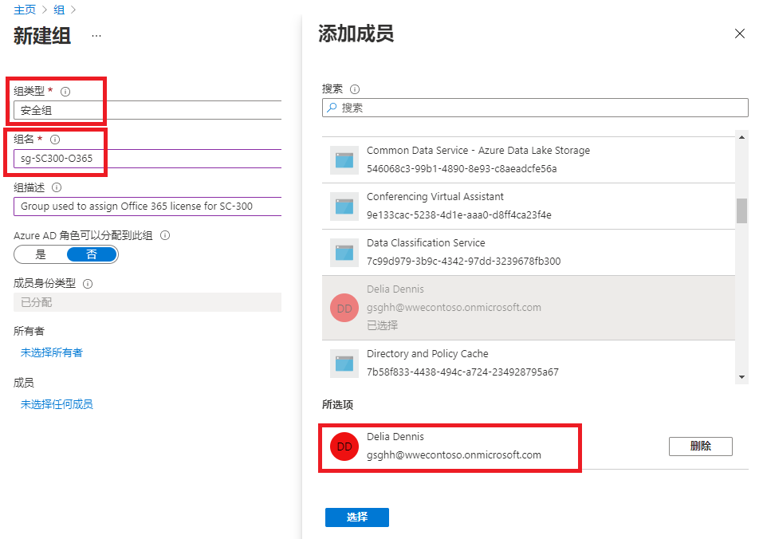
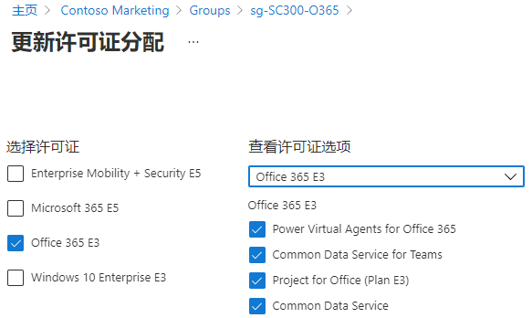

---
lab:
  title: 03 - 使用组成员身份分配许可证
  learning path: '01'
  module: Module 01 - Implement an identity management solution
---

# 实验室 03：使用组成员身份分配许可证

## 实验室方案

你的公司决定使用 Azure AD 中的安全组来管理许可证。 你需要配置新的安全组，向该组分配许可证，以及验证组成员许可证是否已更新。

#### 预计用时：25 分钟

### 练习 1 - 创建安全组并添加用户

#### 任务 1 - 检查 Delia Dennis 是否可以访问 Office 365

1. 启动一个新的 InPrivate 浏览器窗口。
2. 连接到 [https://www.office.com](https://www.office.com)。
3. 选择“登录”并以 Delia Dennis 的身份进行连接。

   | **设置**| **值**|
   | :--- | :--- |
   | 用户名 | DeliaD@`your domain name.com`|
   | 密码| 在“资源”中输入全局管理员的密码|

4. 你应会连接到 Office.com 网站，但会看到一条消息，该消息表示你没有许可证。

   
    
5. 关闭浏览器窗口。

#### 任务 2 - 在 Azure Active Directory 中创建安全组

1. 浏览到 [https://portal.azure.com/#blade/Microsoft_AAD_IAM/ActiveDirectoryMenuBlade/Overview]( https://portal.azure.com/#blade/Microsoft_AAD_IAM/ActiveDirectoryMenuBlade/Overview)。

2. 在左侧导航栏的“管理”下，选择“组”。
3. 在“组”页的菜单中，选择“新建组”。
4. 使用以下信息创建组：

   | **设置**| **值**|
   | :--- | :--- |
   | 组类型| 安全|
   | 组名称| sg-SC300-O365|
   | 成员身份类型| 已分配|
   | 所有者| *分配自己的管理员帐户作为组所有者*|

5. 选择“成员”下的“未选择任何成员”文本。
6. 从用户列表中选择“Delia Dennis”。
7. 选择“选择”按钮  。

   

8. 选择“创建”按钮。
9. 完成后，验证名为“sg-SC300-O365”的组是否显示在“所有组”列表中 。

#### 任务 3 - 向组分配许可证

1. 在“所有组”列表中，选择“sg-SC300-O365” 。
2. 在“市场营销”页的“管理”下，选择“许可证” 。
3. 在菜单中选择“+ 分配”。
4. 在“更新许可证分配”页的“选择许可证”下，查看可用许可证列表，然后选中“Office 365 E3”复选框 。

   提示 - 选择多个许可证后，可使用“查看许可证选项”菜单来选择特定许可证，并查看该许可证的许可证选项。

   

6. 选择“保存”  。

#### 任务 4 - 确认 Office 365 许可证

1. 启动一个新的 InPrivate 浏览器窗口。
2. 连接到 [https://www.office.com](https://www.office.com)。
3. 选择“登录”并以 Delia Dennis 的身份进行连接。

   | **设置**| **值**|
   | :--- | :--- |
   | 用户名 | DeliaD@`your domain name.com`|
   | 密码| 在“资源”中输入全局管理员的密码|

4. 你应连接到 Office.com 网站，然后未看见关于许可证的消息。 所有的 Office 应用程序都可在左侧获取。

   
    
5. 关闭浏览器窗口。 

### 练习 2 - 在 Azure Active Directory 中创建 Microsoft 365 组

#### 任务 1 - 创建组

你作为 Azure AD 管理员的职责之一是创建不同类型的组。 你需要为组织的销售部门创建新的 Microsoft 365 组。

1. 浏览到 [https://portal.azure.com/#blade/Microsoft_AAD_IAM/ActiveDirectoryMenuBlade/Overview]( https://portal.azure.com/#blade/Microsoft_AAD_IAM/ActiveDirectoryMenuBlade/Overview)。

2. 在左侧导航栏的“管理”下，选择“组”。

3. 在“组”页的菜单中，选择“新建组”。

4. 使用以下信息创建组：

   | **设置**| **值**|
   | :--- | :--- |
   | 组类型| Microsoft 365|
   | 组名称| 西北部销售额|
   | 成员身份类型| 已分配|
   | 所有者| *分配自己的管理员帐户作为组所有者*|
   | 成员| Alex Wilber 和 Bianca Pisani|

   

5. 完成后，验证名为“西北部销售额”的组是否显示在“所有组”列表中。

### 练习 3 - 创建将所有用户添加为成员的动态组

#### 任务 1 - 创建动态组

随着公司发展，手动组管理正在变得过于耗时。 由于对目录进行了标准化，现在可以利用动态组。 必须创建新的动态组以确保准备好在生产环境中创建动态组。

1. 使用在租户中分配了全局管理员或用户管理员角色的帐户登录到 [https://portal.azure.com](https://portal.azure.com)。

2. 选择“Azure Active Directory”  。

3. 在“管理”下选择“组”，然后选择“新建组”    。

4. 在“新建组”  页的“组类型”  下选择“安全性”  。

5. 在“组名”框中，输入“SC300-myDynamicGroup” 。

6. 选择“成员身份类型”菜单，然后选择“动态用户”。

7. 为组选择“所有者”。

7. 在“动态用户成员”下，选择“添加动态查询”。

8. 在“规则语法”框上方的右侧，选择“编辑”。

9. 在“编辑规则语法”窗格中的“规则语法”框中输入以下表达式：

   ```powershell
   user.objectid -ne null
   ```

   警告 - `user.objectid` 区分大小写。

10. 选择“确定”。 规则会出现在“规则语法”框中。

   

11. 选择“保存”  。 新的动态组现在将包含 B2B 来宾用户和成员用户。

12. 在“新建组”页上，选择“创建”以创建组。

#### 任务 2 - 验证是否已添加成员

注意 - 动态组成员资格的填充最多可能需要 15 分钟。

1. 选择“主页”`Azure Active Directory`。
2. 启动 Azure Active Directory。
3. 在“管理”菜单中，选择“组” 。
4. 在筛选框中键入“SC300”，此时将列出新创建的组。
5. 选择“SC300-myDynamicGroup”以打开组。
6. 请注意，该组显示包含 30 多个直接成员。
7. 在“管理”菜单中选择“成员” 。
8. 查看成员。

#### 任务 3 - 试验替代规则

1. 尝试创建仅包含来宾用户的组：

   - (user.objectid -ne null) 和 (user.userType -eq "Guest")

2. 尝试创建仅包含 Azure AD 用户成员的组。

   - (user.objectid -ne null) 和 (user.userType -eq "Member")
