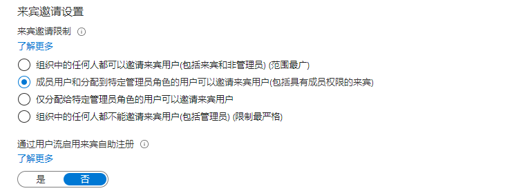

---
lab:
  title: 04 - 配置外部协作设置
  learning path: '01'
  module: Module 01 - Implement an identity management solution
---

# 实验室 04：配置外部协作设置

## 实验室方案

你需要为组织启用外部协作设置以进行批准的来宾访问。

#### 预计用时：5 分钟

### 练习 1 - 允许邀请来宾用户加入组织

#### 任务 1 - 使来宾用户能够执行自助注册

1. 以租户管理员身份登录到  [https://portal.azure.com](https://portal.azure.com)  。
2. 选择“Azure Active Directory” **** 。
3. 选择“用户设置”。
4. 选择“管理外部用户协作设置”。
5. 确保“通过用户流启用来宾自助注册”设置标记为“是” 。
6. 选择屏幕顶部的“保存”。

#### 任务 2 - 配置外部协作设置

1. 以租户管理员身份登录到  [https://portal.azure.com](https://portal.azure.com)  。
2. 选择“Azure Active Directory” **** 。
3. 选择“外部标识”>“所有标识提供者” **** 。
4. 选择屏幕顶部附近的“电子邮件一次性密码”通知链接。

    备注 - 一次性密码是一种非常安全的方式，可用于邀请用户加入组织。
    
5. 确保选中“是”。
6. 根据需要选择“保存”。
7. 否则，选择 `Home > Contoso Marketing >`“外部标识”返回上一屏幕。
8. 选择左侧的“外部协作设置”

9. 在“来宾用户访问权限”下，查看可用的访问级别，然后选择“来宾用户访问权限仅限于自己的目录对象的属性和成员身份（限制最严格）” **** 。

    注意
    - 来宾用户具有与成员相同的访问权限（包括首选项）：此选项使来宾与成员用户具有相同的对 Azure AD 资源和目录数据的访问权限。
    - 来宾用户对目录对象的属性和成员身份具有有限的访问权限：（默认值）此设置阻止来宾执行某些目录任务，例如枚举用户、组或其他目录资源。 来宾可以看到所有非隐藏组的成员身份。
    - 来宾用户访问权限仅限于自己的目录对象的属性和成员身份（最严格）：使用此设置，来宾只能访问自己的配置文件。 来宾不能看到其他用户的个人资料、组或组成员身份。

    

10. 在“来宾邀请设置”下，选择“成员用户和分配有特定管理员角色的用户可以邀请来宾用户，包括具有成员权限的来宾”！ ****

    注意
    - 组织中的任何人都可以邀请包括来宾和非管理员在内的来宾用户(范围最广)：若要允许组织中的来宾邀请其他来宾（包括不是组织成员的来宾），请选择此单选按钮。
    - 成员用户和分配到特定管理员角色的用户可以邀请来宾用户(包括具有成员权限的来宾)：若要允许成员用户和具有特定管理员角色的用户邀请来宾，请选择此单选按钮。
    - 仅分配到特定管理员角色的用户可以邀请来宾用户：若只允许那些具有管理员角色的用户邀请来宾，请选择此单选按钮。 管理员角色包括全局管理员、用户管理员和来宾邀请者。
    - 组织中的任何人都不能邀请包括管理员在内的来宾用户(限制最严格)：若要拒绝组织中的每个人邀请来宾，请选择此单选按钮。
    - 如果“成员可以邀请”设为“否”，而“来宾邀请者角色中的管理员和用户可以邀请”设为“是”，则“来宾邀请者”角色中的用户仍将能够邀请来宾。

    

11. 在“协作限制”下，查看可用选项并接受默认设置 **** 。

    **重要事项**
    - 可以创建允许列表或拒绝列表。 不能同时设置这两种类型的列表。 默认情况下，不在允许列表中的任何域都会包含在拒绝列表中，反之亦然。
    - 对于每个组织，只能创建一个策略。 可以更新策略以包含更多的域，或者删除策略以创建新策略。
    - 可以添加到允许列表或拒绝列表的域数仅受策略大小限制。 整个策略的最大大小为 25 KB（25,000 个字符），其中包括允许列表或拒绝列表以及为其他功能配置的任何其他参数。
    - 此列表独立于 OneDrive for Business 和 SharePoint Online 允许/阻止列表。 若要在 SharePoint Online 中限制单个文件的共享，需要为 OneDrive for Business 和 SharePoint Online 设置允许或拒绝列表。
    - 此列表不适用于已兑换邀请的外部用户。 设置列表后，将强制实施该列表。 如果用户邀请处于挂起状态，而你设置了一个阻止该用户的域的策略，则该用户在尝试兑换邀请时将会失败。

12. 完成后，保存所做的更改。
