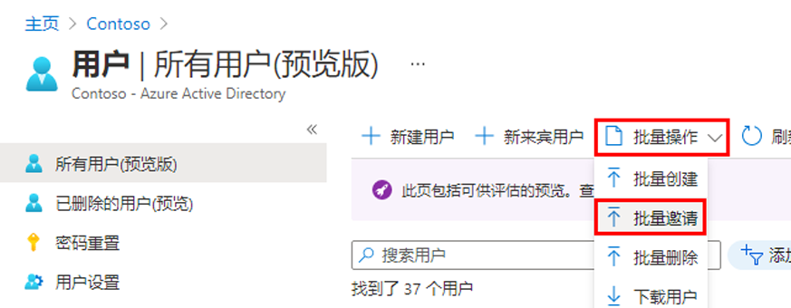
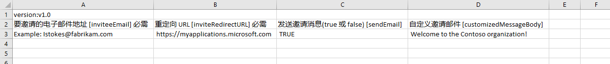
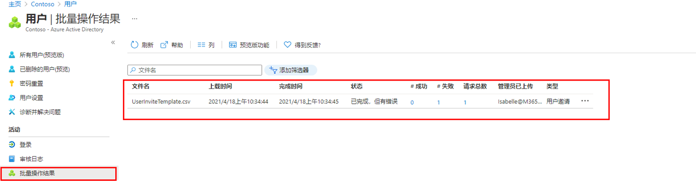

---
lab:
  title: 05 - 将来宾用户添加到目录
  learning path: '01'
  module: Module 01 - Implement an identity management solution
---

# 实验室 05：将来宾用户添加到目录

### 登录类型 = Microsoft 365 管理

## 实验室方案

你的公司与许多供应商合作，有时你需要将一些供应商帐户作为来宾添加到你的目录。

#### 预计用时：20 分钟

### 练习 1 - 将来宾用户添加到目录

#### 任务 - 添加来宾用户

1. 以分配了有限管理员目录角色或来宾邀请者角色，或者以全局管理员的用户身份登录到 https://entra.Microsoft.com [](https://entra.microsoft.com) 。

2. 选择“标识” ****。

3. 在“用户” **** 下，选择“所有用户” ****。

4. 选择“+ 新建用户” **** 。

5. 在“新建用户”菜单上，选择“邀请外部用户”，然后将信息添加为来宾用户。

    备注 - 不支持组电子邮件地址；输入个人的电子邮件地址。 另外，某些电子邮件提供程序允许用户向其电子邮件地址中添加加号 (+) 和附加文本来帮助执行收件箱筛选之类的操作。 但是，Microsoft Entra ID 当前不支持在电子邮件地址中使用加号。 为避免在传送时出现问题，请省略加号及其之后的任何字符，直至 @ 符号。

6. 输入电子邮件地址，例如 **sc300externaluser1@sc300email.com** 。

7. 选择“属性”选项卡。

8. 在“用户”页上，验证是否列出了帐户，并在“用户类型”列中，验证是否显示“来宾” 。

9. 完成后，选择“查看 + 邀请”****，然后选择“邀请”****。


发送邀请后，该用户帐户将以来宾的形式自动添加到目录。


### 练习 2 - 批量邀请来宾用户

#### 任务 1 - 批量邀请用户

最近与另一家公司建立了合作伙伴关系。 目前，合作伙伴公司的员工将作为来宾添加。 你需要确保可一次性导入多个来宾用户。

1. 以全局管理员身份登录 [https://entra.microsoft.com](https://entra.microsoft.com)。

2. 在导航窗格中，选择“标识”****。

3. 在“用户”**** 下，选择“所有用户”****。

4. 在“用户”页的菜单上，选择“批量操作”>“批量邀请”。

     

5. 在“批量邀请用户”窗格中，选择“下载”到具有邀请属性的示例 CSV 模板。

6. 使用编辑器查看 CSV 文件，查看模板。

7. 打开 .csv 模板，为每个来宾用户添加一行。 必需的值为：

    - **要邀请的电子邮件地址** - 会收到邀请的用户
    - **重定向 URL** - 一个 URL，受邀请的用户在接受邀请后会被系统定向到该 URL。

    

8. 保存文件。

9. 在“批量邀请用户”页中，在“上传 csv 文件”下，浏览找到该文件。

     备注 - 选择 .csv 文件后立即开始对它的验证。

10. 验证文件内容后，你将看到“文件成功上传”。 如果有错误，必须修正错误，然后才能提交作业。

    

11. 文件通过验证以后，请选择“提交”，开始用于添加邀请的 Azure 批量操作。

12. 若要查看作业状态，请选择“选择此处查看每项操作的状态”。 也可在“活动”部分中选择“批量操作结果”。 要详细了解批量操作中每个行项，请选择“成功数”、“失败数”或“请求总数”列下的值  。 如果失败，则会列出失败原因。

    

13. 作业完成后，会显示一条通知，指出批量操作成功。

#### 任务 2 - 使用 PowerShell 邀请来宾用户

1. 以管理员身份打开 PowerShell。这可以通过在 Windows 中搜索 PowerShell 并选择“以管理员身份运行”来完成。 

**备注** - 此实验室需要具有 PowerShell 版本 7.2 或更高版本才能正常运行。  当 PowerShell 打开时，屏幕顶部会显示版本，如果正在运行的版本较旧，请更新，否则实验室的此部分将失败。

2. 如果以前未使用过 Microsoft.Graph PowerShell 模块，则需要安装该模块。  运行以下两个命令，并在系统提示确认时按 Y：

    ```
    Install-Module Microsoft.Graph
    ```
3. 确认已安装 Microsoft.Graph 模块：

    ```
    Get-InstalledModule Microsoft.Graph
    ```
    

4. 接下来，需要通过运行以下命令登录到 Azure：  

    ```
    Connect-MgGraph -Scopes "User.ReadWrite.All"
    ``` 
    Edge 浏览器将打开，系统会提示你登录。  使用 MOD 管理员帐户进行连接。  标记同意框，接受权限请求，然后关闭浏览器窗口。

5. 设置电子邮件的值，并为外部用户重定向：

    ```
    Import-Module Microsoft.Graph.Identity.SignIns
    
    $params = @{
        invitedUserEmailAddress = "admin@fabrikam.com"
        inviteRedirectUrl = "https://myapp.contoso.com"
    }
    ```

6. 发送 MgInvitation 命令以邀请外部用户：

    ```
    New-MgInvitation -BodyParameter $params
    ```

7. 此时可以关闭 PowerShell。
    
现在，你已了解如何在 Microsoft Entra 管理中心、Microsoft 365 管理中心中邀请用户，使用 csv 文件批量邀请以及使用 PowerShell 命令邀请用户。  可以进入 Microsoft Entra 管理中心，并检查“所有用户”以查看已将管理员添加为外部用户。
