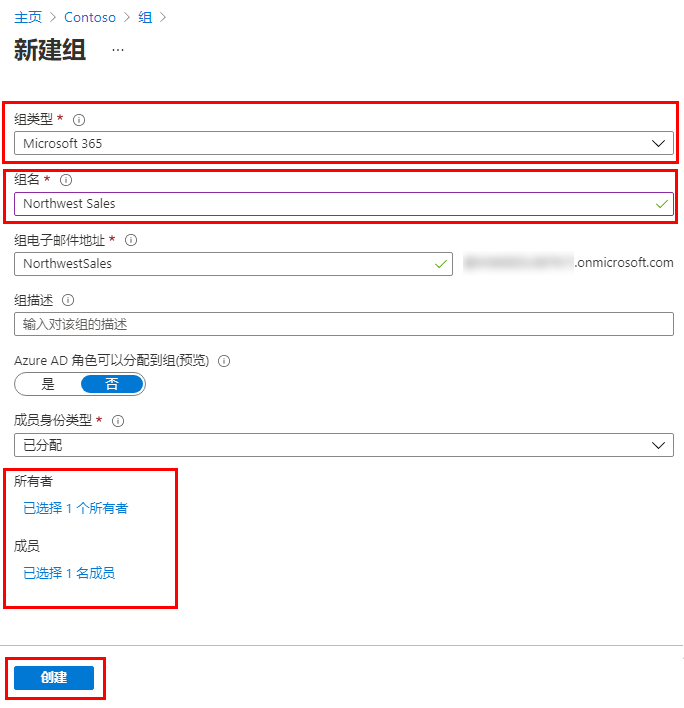

---
lab:
  title: 05 - 向 Azure AD 添加组
  learning path: "01"
  module: Module 01 - Implement an identity management solution
ms.openlocfilehash: 192cb3bc35b573ed3b4799cfb3872038874cb521
ms.sourcegitcommit: 448f935ad266989a6f0086019e0c0e0785ad162b
ms.translationtype: HT
ms.contentlocale: zh-CN
ms.lasthandoff: 02/10/2022
ms.locfileid: "138421444"
---
# 实验室 05：向 Azure AD 添加组

## 实验室方案

你作为 Azure AD 管理员的职责之一是创建不同类型的组。 你需要为组织的销售部门创建新的 Microsoft 365 组。

#### 预计用时：5 分钟

### 练习 1 - 在 Azure Active Directory 中创建 Microsoft 365 组

#### 任务 1 - 创建组

1. 浏览到 [https://portal.azure.com/#blade/Microsoft_AAD_IAM/ActiveDirectoryMenuBlade/Overview]( https://portal.azure.com/#blade/Microsoft_AAD_IAM/ActiveDirectoryMenuBlade/Overview)。

2. 在左侧导航栏的“管理”下，选择“组”。

3. 在“组”边栏选项卡的菜单中，选择“新建组”。

4. 使用以下信息创建组：

    | **设置**| **值**|
    | :--- | :--- |
    | 组类型| Microsoft 365|
    | 组名称| 西北部销售额|
    | 成员身份类型| 已分配|
    | 所有者| *分配自己的管理员帐户作为组所有者*|
    | 成员| Alex Wilber 和 Bianca Pisani |

    

5. 完成后，验证名为“西北部销售额”的组是否显示在“所有组”列表中。
