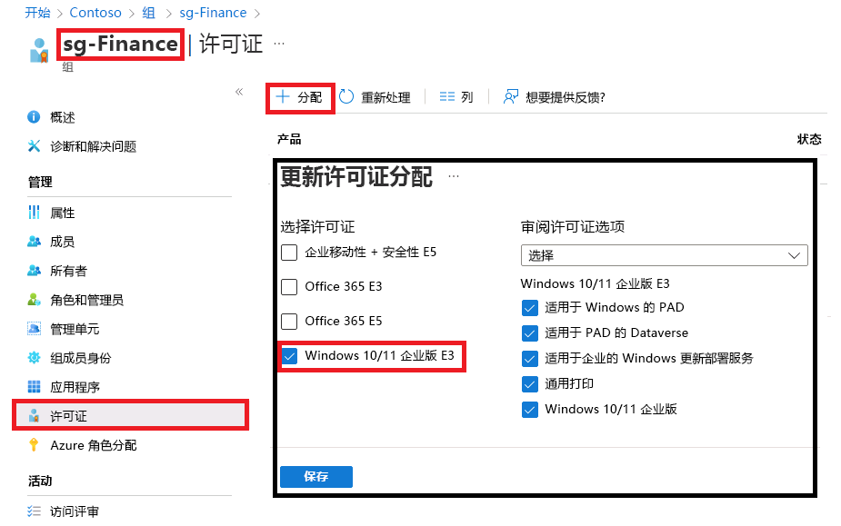

---
lab:
  title: 06 - 更改组许可证分配
  learning path: "01"
  module: Module 01 - Implement an identity management solution
ms.openlocfilehash: a76182eb79197a26a692c5bab7bfcde1080a97c2
ms.sourcegitcommit: a60b8d48791d600c44fa5fa617b6a9b2c0edaa71
ms.translationtype: HT
ms.contentlocale: zh-CN
ms.lasthandoff: 04/04/2022
ms.locfileid: "141368856"
---
# 实验室 6：更改组许可证分配

## 实验室方案

你有时可能需要更改 Azure AD 安全组使用的许可证分配。 你需要确保熟悉更改组的许可证分配的流程。

#### 预计用时：5 分钟

### 练习 1 - 更改组许可证分配

#### 任务 - 使用 Azure AD 门户进行更改

1. 浏览到 [https://portal.azure.com/#blade/Microsoft_AAD_IAM/ActiveDirectoryMenuBlade/Overview]( https://portal.azure.com/#blade/Microsoft_AAD_IAM/ActiveDirectoryMenuBlade/Overview)。

2. 在左侧导航栏的“管理”下，选择“组”。

3. 选择 sg-Finance 组。

4. 在左侧导航栏的“管理”下，选择“许可证”。

5. 查看当前分配，然后在菜单上选择“+ 分配”。

    

6. 在“更新许可证分配”边栏选项卡上，单独或组合使用以下操作：选择“Windows 10/11 企业版 E3”许可证、取消选择现有许可证、添加或删除许可证选项。

7. 完成后选择“保存”。

8. 在组的“许可证”页上，查看所做的更改。
