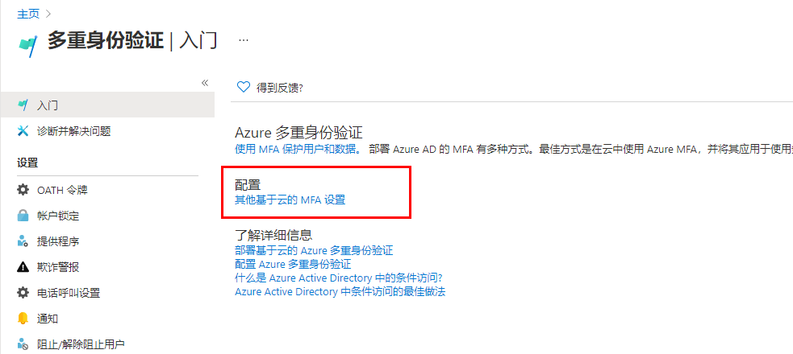
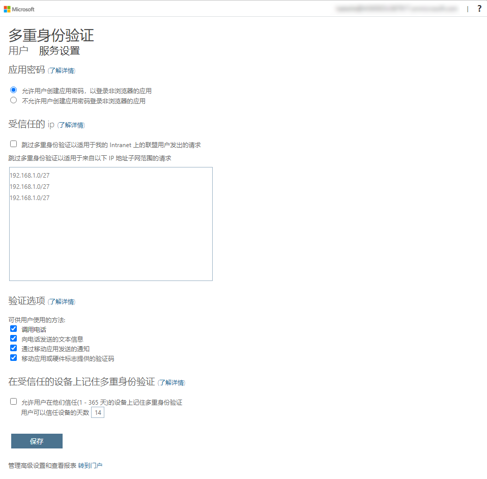
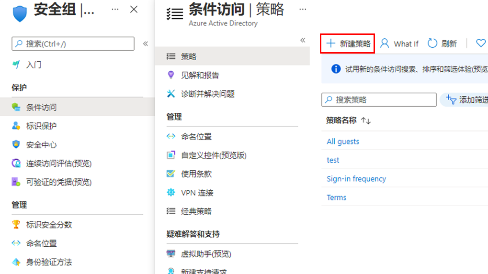

---
lab:
  title: 08 - 启用多重身份验证
  learning path: '02'
  module: Module 02 - Implement an Authentication and Access Management Solution
---

# 实验室 08 - 启用多重身份验证

## 实验室方案

为了提高组织中的安全性，你被要求启用 Microsoft Entra ID 的多重身份验证。

#### 预计用时：15 分钟

**重要提示** - 此练习需要 Microsoft Entra ID Premium 许可证。

### 练习 1 - 在 Azure 中查看并启用多重身份验证

#### 任务 1 - 查看 Azure 多重身份验证选项

1. 浏览到 [https://entra.microsoft.com](https://entra.microsoft.com)，使用目录的全局管理员帐户登录。

2. 使用搜索功能，搜索“多重”****。

3. 在搜索结果中，选择“多重身份验证”****。

    或者，可以打开“标识”****，选择“保护”****，然后选择“多重身份验证”****。

4. 在“开始使用”页面中的“配置”下，选择“其他基于云的 MFA 设置” 。

    

5. 在新的浏览器页面中，可看到适用于 Azure 用户的 MFA 选项和服务设置。

    

    可以在此处选择受支持的身份验证方法，在上面的屏幕中，所有方法均已选中。

    还可以在此处启用或禁用应用密码，以使用户可以为不支持多重身份验证的应用创建唯一的帐户密码。 借助此功能，用户可以使用特定于该应用的其他密码通过其 Microsoft Entra 标识进行身份验证。

#### 任务 2 - 为 Delia Dennis 设置 MFA 的条件访问规则

接下来，让我们研究如何设置条件访问策略规则，此类规则将对访问网络上的特定应用的来宾用户强制执行 MFA。

1. 切换回 Microsoft Entra 管理中心，依次选择“标识”****、“保护”****、“条件访问”****。

2. 在菜单中选择“+ 新建策略”。 从下拉列表中选择“+ 创建新策略”****。

    

3. 为策略命名，例如 MFA_for_Delia。

4. 选择“分配”下的“用户或工作负载标识”。

    - 选择“已选择 0 个用户或工作负载标识”  
    - 在屏幕右侧选择“选择用户和组”复选框以进行配置。
    - 检查“用户和组”（可用用户将填充到右侧）
    - 从用户列表中选择“Delia Dennis”，然后选择“选择”按钮 。

5. 在“目标资源”下，选择“未选择目标资源”****。

   - 在下拉菜单中，确保选中“云应用”。
   - 在“包含”下，标记“所有云应用”，并注意弹出的有关可能将自己锁定的警告。 
   - 现在在“包含”下，将你的选择更改为“选择应用”项。
   - 在新打开的对话框中，选择“Office 365”。
      - 提醒：在之前的实验室中，我们为 Delia Dennis 提供了 Office 365 许可证并登录以确保其正常工作。
   - 选择“选择”。

6. 查看“条件”部分。

   - 选择“位置”，然后将其配置为“任意位置”。

7. 在“访问控制”**** 下找到“授权”**** 部分，选择“已选择 0 个控件”****。

8. 选中“需要多重身份验证”**** 复选框以强制实施 MFA。

9. 确保已选择“要求所有选择的控制”。

10. 选择“选择”  。

11. 将“启用策略”设置为“打开”。

12. 点击“创建”以创建策略。

    

    现已为所选的用户和应用程序启用 MFA。 下次来宾尝试登录该应用时，系统将提示他们注册 MFA。

#### 任务 3 - 测试 Delia 的登录

1. 打开一个新的 InPrivate 浏览窗口。
2. 连接到 https://www.office.com。
3. 选择登录选项。
4. 输入 DeliaD@ `<<your domain address>>`。
5. 输入密码 = 输入租户的全局管理员密码（备注：请参阅“实验室资源”选项卡以检索管理员密码）。

注意 - 此时将出现以下两种情况之一。  收到一条提示你需要设置 Authenticator 应用以及注册 MFA 的消息。  使用你的个人电话按照提示完成注册。  备注 - 你可能会收到一条登录失败的消息，其中包含几个有关如何继续的选项。  在这种情况下，选择“重试”。

可以看到，由于我们为 Delia 创建了条件访问规则，因此需要进行 MFA 才可启动 Office 365 主页。

### 练习 2 - 配置登录所需的 MFA

#### 任务 1 - 配置 Microsoft Entra 每用户 MFA

最后，我们介绍如何为用户帐户配置 MFA。 这是获取多重身份验证设置的另一种方法。

1. 切换回 Microsoft Entra 管理中心，查找“标识”左侧导航菜单。

2. 选择“用户”****，然后选择“所有用户”****。

3. 在“用户”窗格的顶部，选择“每用户 MFA”。

   

4. 新的浏览器选项卡/窗口将打开多重身份验证用户设置对话框。

   可以通过选择一位用户，然后使用右侧的快捷步骤，为用户启用或禁用 MFA。

   

5. 使用复选标记选中“Adele Vance”。
6. 在快速步骤下选择“启用选项”。
7. 阅读弹出的通知消息，然后选择“启用多重身份验证”按钮。
8. 选择“**关闭**”。
9. 请注意，Adele 目前的 MFA 状态为“已启用”。
10. 可以选择“服务设置”以查看 MFA 设置屏幕，如本实验室前面部分所示。
11. 关闭 MFA 设置选项卡。

#### 任务 2 - 尝试以 Adele 的身份登录

1. 如果你想查看另一 MFA 登录流程示例，可以尝试以 Adele 身份登录。
