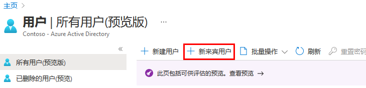

---
lab:
  title: 09 - 将来宾用户添加到目录
  learning path: "01"
  module: Module 01 - Implement an identity management solution
ms.openlocfilehash: 9410e7a9c69431ece616a1af29ae52b76c7f38b7
ms.sourcegitcommit: 448f935ad266989a6f0086019e0c0e0785ad162b
ms.translationtype: HT
ms.contentlocale: zh-CN
ms.lasthandoff: 02/10/2022
ms.locfileid: "138421423"
---
# 实验室 09：将来宾用户添加到目录

## 实验室方案

你的公司与许多供应商合作，有时你需要将一些供应商帐户作为来宾添加到你的目录。

#### 预计用时：5 分钟

### 练习 1 - 将来宾用户添加到目录

#### 任务 - 添加来宾用户

1. 以拥有受限的管理员目录角色或来宾邀请者角色的用户身份登录 [https://portal.azure.com](https://portal.azure.com)。

2. 选择“Azure Active Directory” 。

3. 在“管理”下，选择“用户” 。

4. 选择“新来宾用户”。

    

5. 在“新建用户”页面上，选择“邀请用户”，然后将信息添加为来宾用户。

    备注 - 不支持组电子邮件地址；输入个人的电子邮件地址。 另外，某些电子邮件提供程序允许用户向其电子邮件地址中添加加号 (+) 和附加文本来帮助执行收件箱筛选之类的操作。 但是，Azure AD 当前不支持在电子邮件地址中使用加号。 为避免在传送时出现问题，请省略加号及其之后的任何字符，直至 @ 符号。

6. 完成后选择“邀请”。

7. 在“用户”边栏选项卡上，验证是否列出了帐户，并在“用户类型”列中，验证是否显示“来宾”。

发送邀请后，该用户帐户将以来宾的形式自动添加到目录。
