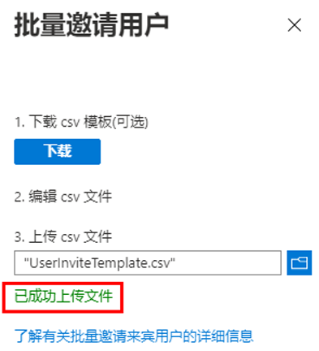

---
lab:
  title: 10 - 批量邀请来宾用户”
  learning path: "01"
  module: Module 01 - Implement an identity management solution
ms.openlocfilehash: 5f8181892dabf5f4dbc00f1241101a636bf0c184
ms.sourcegitcommit: 448f935ad266989a6f0086019e0c0e0785ad162b
ms.translationtype: HT
ms.contentlocale: zh-CN
ms.lasthandoff: 02/10/2022
ms.locfileid: "138421429"
---
# 实验室 10：批量邀请来宾用户

## 实验室方案

最近与另一家公司建立了合作伙伴关系。 目前，合作伙伴公司的员工将作为来宾添加。 你需要确保可一次性导入多个来宾用户。

#### 预计用时：10 分钟

### 练习 1 - 批量邀请来宾用户

#### 任务 - 批量邀请用户

1. 以全局管理员身份登录 [https://portal.azure.com](https://portal.azure.com)。

2. 在导航窗格中选择“Azure Active Directory”。

3. 在“管理”下，选择“用户” 。

4. 在“用户”边栏选项卡上的菜单上，选择“批量操作”>“批量邀请”。

     

5. 在“批量邀请用户”窗格中，选择“下载”到具有邀请属性的示例 CSV 模板。

6. 使用编辑器查看 CSV 文件，查看模板。

7. 打开 .csv 模板，为每个来宾用户添加一行。 必需的值为：

    - **要邀请的电子邮件地址** - 会收到邀请的用户
    - **重定向 URL** - 一个 URL，受邀请的用户在接受邀请后会被系统定向到该 URL。

    

8. 保存文件。

9. 在“批量邀请用户”页中，在“上传 csv 文件”下，浏览找到该文件。

     备注 - 选择 .csv 文件后立即开始对它的验证。

10. 验证文件内容后，你将看到“文件成功上传”。 如果有错误，必须修正错误，然后才能提交作业。

    

11. 文件通过验证以后，请选择“提交”，开始用于添加邀请的 Azure 批量操作。

12. 若要查看作业状态，请选择“单击此处查看每项操作的状态”。 也可在“活动”部分中选择“批量操作结果”。 要详细了解批量操作中每个行项，请选择“成功数”、“失败数”或“请求总数”列下的值  。 如果失败，则会列出失败原因。

    

13. 作业完成后，会显示一条通知，指出批量操作成功。
