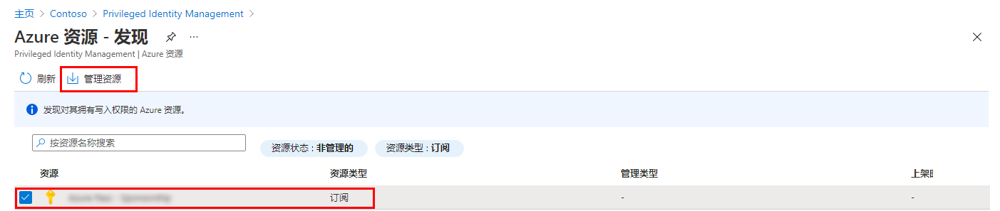

---
lab:
  title: 11 - 在 Privileged Identity Management 中分配 Azure 资源角色
  learning path: "02"
  module: Module 02 - Implement an authentication and access management solution
ms.openlocfilehash: ca3725a8f81afffeb093fc997c2caf7917a35948
ms.sourcegitcommit: 80c5c0ef60c1d74fcc58c034fe6be67623013cc0
ms.translationtype: HT
ms.contentlocale: zh-CN
ms.lasthandoff: 07/01/2022
ms.locfileid: "146823190"
---
# 实验室 11 - 在 Privileged Identity Management 中分配 Azure 资源角色

注意 - 此实验室需要 Azure Pass。 有关说明，请参阅实验室 00。

## 实验室方案

Azure Active Directory (Azure AD) Privileged Identity Management (PIM) 可以管理内置的 Azure 资源角色以及自定义角色，包括但不限于：

- “所有者”
- 用户访问管理员
- 参与者
- 安全管理员
- 安全管理器

你需要使用户符合 Azure 资源角色的条件。

#### 预计用时：10 分钟

### 练习 1 - 针对 Azure 资源的 PIM

#### 任务 1 - 分配 Azure 资源角色

1. 使用全局管理员帐户登录 [https://portal.azure.com](https://portal.azure.com)。

2. 搜索并选择“Azure AD Privileged Identity Management”。

3. 在“Privileged Identity Management”页的左侧导航窗格中选择“Azure 资源”。

4. 在顶部菜单中选择“发现资源”。

5. 在“Azure 资源 - 发现”页中，选择订阅，然后在顶部菜单中选择“管理资源”。

   

6. 在“加入要管理的所选资源”对话框中，查看信息，然后选择”确定”。

7. 加入完成后，关闭“Azure 资源 - 发现”页。

8. 在 Azure 资源页中，选择订阅。

   

9. 在左侧导航菜单中，在“管理”下选择“角色”以查看适用于 Azure 资源的角色列表。

10. 在顶部菜单中，选择“+ 添加分配”。

11. 在“添加分配”页中，选择“选择角色”菜单，然后选择“API 管理服务参与者” 。

12. 在“选择成员”下，选择“未选择任何成员”。

13. 从组织中选择“Miriam Graham”，该成员将被分配角色。  然后选择“选择”。

14. 选择“**下一页**”。

15. 在“设置”选项卡的“分配类型”下，选择“符合条件”。

   - “合格”  分配要求该角色的成员执行某个操作才能使用该角色。 操作可能包括执行多重身份验证 (MFA) 检查、提供业务理由或请求获得指定审批者的批准。

   - “活动”分配不要求成员执行任何操作便可使用该角色。 分配为“活动”的成员拥有始终分配给该角色的特权。

16. 通过更改开始和结束日期和时间来指定分配持续时间。

17. 完成后，选择“分配”。

18. 创建新的角色分配后，会显示状态通知。

#### 任务 2 - 更新或删除现有资源角色分配

按照以下步骤更新或删除现有的角色分配。

1. 打开“Azure AD Privileged Identity Management”。

2. 选择“Azure 资源” 。

3. 选择要管理的订阅，打开其概述页。

4. 在“管理”下选择“分配” 。

5. 在“符合条件的角色”选项卡的“操作”列中，查看可用选项。

6. 选择“删除” 。

7. 在“删除”对话框中，查看信息，然后选择“是”。
