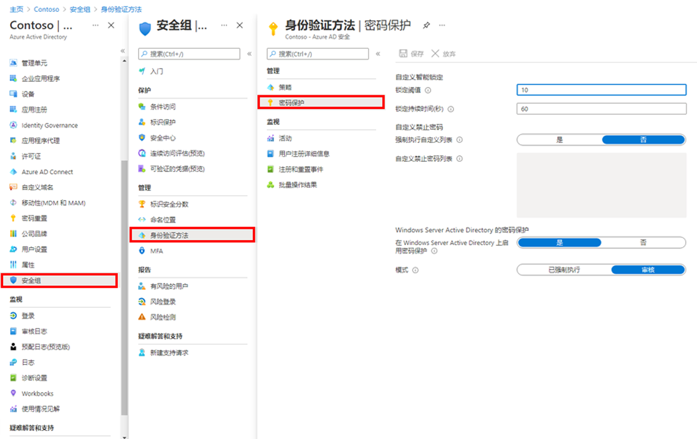

---
lab:
  title: 12 - 管理 Azure AD 智能锁定值
  learning path: "02"
  module: Module 02 - Implement an Authentication and Access Management Solution
ms.openlocfilehash: 4dbd02bc2df86fbdd9ff6589a1c1123f0aa5bb1c
ms.sourcegitcommit: b5fc07c53b5663eaa1883cf38b70c57cd88470ca
ms.translationtype: HT
ms.contentlocale: zh-CN
ms.lasthandoff: 06/29/2022
ms.locfileid: "146741582"
---
# 实验室 12 - 管理 Azure AD 智能锁定值

## 实验室方案

你需要为组织配置附加密码保护设置。

#### 预计用时：5 分钟

### 练习 1 - 管理 Azure AD 智能锁定值

#### 任务 - 添加智能锁定

根据组织要求，可自定义 Azure AD 智能锁定值。 要使用组织特定的值自定义智能锁定设置，需要向用户提供 Azure AD Premium P1 或更高版本的许可证。

1. 浏览到 [https://portal.azure.com](https://portal.azure.com)，使用目录的全局管理员帐户登录。

2. 打开门户菜单，然后选择“Azure Active Directory”。

3. 在“Azure Active Directory”页的“管理”下，选择“安全性” 。

4. 在“安全性”页的左侧导航栏中，选择“身份验证方法”。

5. 在左侧导航栏中，选择“密码保护”。

    

6. 在“密码保护”设置的“锁定持续时间(秒)”框中，将值设置为“120” 。

7. 在“模式”旁边，选择“强制执行”。

8. 保存所做更改。

    备注 - 触发智能锁定阈值后，你将在帐户锁定时收到以下消息：
    - 帐户暂时锁定以防止未经授权的使用。 请稍后再试！如果仍有问题，请与管理员联系。

9. 这可以通过在 Azure AD 租户中选择一个用户进行测试，在专用浏览器中导航到 <login.microsoftonline.com> 并输入错误的密码，直到该帐户收到锁定通知为止。
