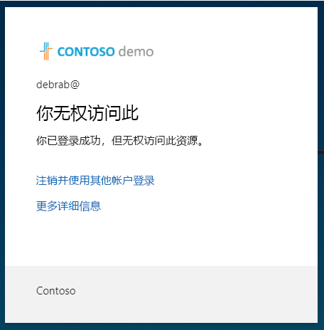

---
lab:
  title: 13 - 实现和测试条件访问策略
  learning path: "02"
  module: Module 02 - Implement an Authentication and Access Management Solution
ms.openlocfilehash: 495af1fb6b24a421754f186f445aca78a6f9f15c
ms.sourcegitcommit: 80c5c0ef60c1d74fcc58c034fe6be67623013cc0
ms.translationtype: HT
ms.contentlocale: zh-CN
ms.lasthandoff: 07/01/2022
ms.locfileid: "146823199"
---
# 实验室 13 - 实现和测试条件访问策略

## 实验室方案

你的公司需要能够限制用户访问其内部应用程序。 你需要部署 Azure Active Directory 条件访问策略。

注意 - 对于条件访问策略，可以禁用安全默认值，要记住的关键点来自培训。  可在此链接中找到有关安全默认值的其他信息：<https://docs.microsoft.com/en-us/azure/active-directory/fundamentals/concept-fundamentals-security-defaults>

#### 预计用时：30 分钟

### 练习 1 - 设置条件访问策略以阻止 DebraB 访问 Yammer

#### 任务 1 -- 确认 DebraB 可以访问 Yammer

1. 启动一个新的 InPrivate 浏览器窗口。
2. 连接到 [https://www.office.com](https://www.office.com) 
3. 出现提示时，以 DebraB 身份登录：

   | 设置 | 值 |
   | :--- | :--- |
   | 用户名 | DebraB@ `<<your lab domain>>.onmicrosoft.com` |
   | 密码 | 输入租户的管理员密码（请参阅“实验室资源”选项卡以检索租户管理员密码）。 |
    
4. 选择 Yammer 图标以查看它是否正确加载。

#### 任务 2 - 创建条件访问策略

Azure Active Directory 条件访问是一项 Azure AD 高级功能，可用于指定控制谁可以访问资源的详细策略。 使用条件访问，可以通过基于组、设备类型、位置和角色等限制用户的访问来保护应用程序。

1. 浏览到 [https://portal.azure.com](https://portal.azure.com)，使用目录的全局管理员帐户登录。

2. 打开门户菜单，然后选择“Azure Active Directory”。

3. 在“Azure Active Directory”页的“管理”下，选择“安全性” 。

4. 在“安全性”页的左侧导航栏中，选择“条件访问”。

5. 在顶部菜单中选择“+ 新建策略”，然后从下拉列表中选择“创建新策略” 。

   

6. 在“名称”框中，输入“阻止 DebraB 登录 Yammer” 。

   备注 - 使用此命名可帮助你快速识别策略及其功能。

7. 在“分配”下，选择“用户或工作负载标识” 。

8. 在“包括”选项卡上，选中“用户和组”复选框。

9. 在“选择”窗格中，选择“DebraB”帐户，然后选择“选择” 。

10. 选择“云应用或操作”。

11. 确认已选择“云应用”，然后选择“选择应用”。

12. 在“选择”窗格中，搜索“Yammer”并选择“Office 365 Yammer”，然后选择“选择”  。

13. 在“访问控制”  下，选择“授予”  。

14. 在“授予”窗格中，选择“阻止访问”，然后选择“选择”。

   备注 - 此策略配置为仅用于练习，用于快速演示条件访问策略。

15. 在“启用策略”  下，选择“启用”  ，然后选择“创建”  。

   

#### 任务 3 - 测试条件访问策略

你应该测试条件访问策略，以确保它们按预期工作。

1. 打开一个新的“Inprivate”浏览器标签页，然后浏览到 [https://www.yammer.com/office365](https://www.yammer.com/office365)。
    - 出现提示时，以 DebraB 身份登录：

   | 设置 | 值 |
   | :--- | :--- |
   | 用户名 | DebraB@ `<<your lab domain>>.onmicrosoft.com` |
   | 密码 | 输入租户的管理员密码（请参阅“实验室资源”选项卡以检索租户管理员密码）。 |
     
2. 验证你已成功阻止访问 Microsoft Yammer。

   

3. 如果你已登录，请关闭选项卡，等待 1 分钟，然后重试。
    
   备注 - 如果以 DebraB 的身份自动登录到 Yammer，则需要手动注销。凭据/访问权限已缓存。  注销并登录后，Yammer 会话应会拒绝访问。

4. 关闭选项卡并返回到“条件访问”页。

5. 选择“Yammer 条件访问”策略。

6. 在“启用策略”下，选择“关闭”，然后选择“保存”。

### 练习 2 - 使用“What if”测试条件访问策略

#### 任务 - 使用 What if 测试条件访问策略

1. 打开门户菜单，然后选择“Azure Active Directory”。

1. 在“Azure Active Directory”页的“管理”下，选择“安全性” 。

1. 在“安全性”页的左侧导航栏中，选择“条件访问”。

1. 选择“What if”。

1. 在“用户或工作负载标识”下，选择“未选择任何用户或服务主体” 。

1. 选择“DebraB”作为用户。

1. 在“云应用、操作或身份验证上下文”下，选择“Yammer” 。 

1. 选择“What if”。 将在磁贴底部为你提供一个关于“要应用的策略”和“将不会应用的策略”的报表 。

通过该报表可在启用策略之前测试策略及其有效性。

### 练习 3 - 使用条件访问策略配置登录频率控制

#### 任务 - 使用 Azure 门户配置条件访问

作为你所在公司的大型安全配置的一部分，你需要测试可用于控制登录频率的条件访问策略

1. 浏览到 [https://portal.azure.com](https://portal.azure.com)，使用目录的全局管理员帐户登录。

2. 打开门户菜单，然后选择“Azure Active Directory”。

3. 在“Azure Active Directory”页的“管理”下，选择“安全性” 。

4. 在“安全性”页的左侧导航栏中，选择“条件访问”。

5. 在顶部菜单中选择“+ 新建策略”，然后从下拉列表中选择“创建新策略” 。

   

6. 在“名称”框中，输入“登录频率”。

7. 在“分配”下，选择“用户或工作负载标识” 。

8. 在“包括”选项卡上，选中“用户和组”复选框。

9. 在“选择”窗格中，选择“Grady Archie”帐户，然后选择“选择” 。

10. 选择“云应用或操作”。

11. 确认已选择“云应用”，然后选择“选择应用”。

12. 在“选择”窗格中，选择“Office 365”，然后选择“选择”。

13. 在“访问控制”下，选择“会话”。

14. 在“会话”窗格中，选择“登录频率”。

15. 在值框中，输入“30”。

16. 依次选择单位菜单、“天数”，然后选择“选择”。

17. 在“启用策略”下，选择“仅限报告”，然后选择“创建”。

   

   备注 - 仅限报告模式是一种新的条件访问策略状态，允许管理员在其环境中启用条件访问策略之前评估该策略的影响。 随着仅限报告模式的发布：
    
- 可以在仅限报告模式下启用条件访问策略。
- 在登录过程中，将评估仅限报告模式下的策略，但不强制执行这些策略。
- 结果记录在登录日志详细信息的“条件访问”和“仅限报告”选项卡中。
- 具有 Azure Monitor 订阅的客户可以使用条件访问见解工作簿来监视其条件访问策略的影响。
