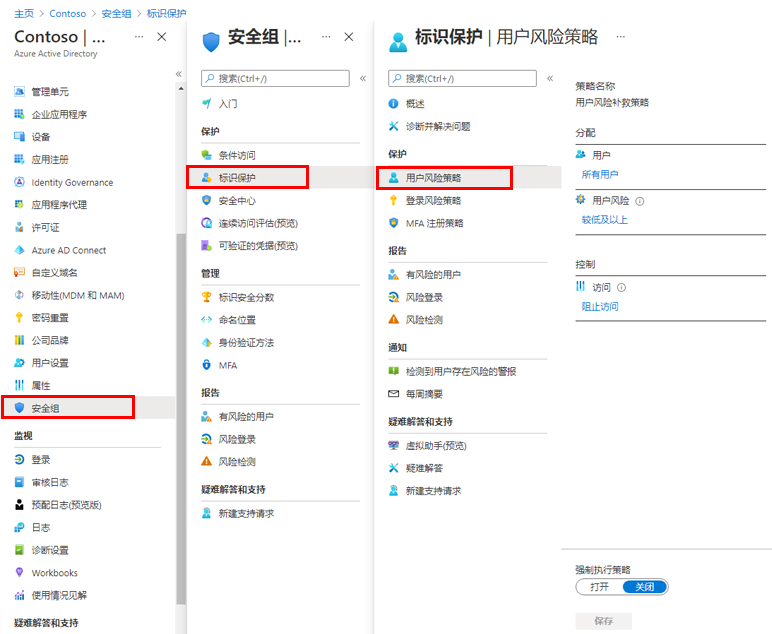

---
lab:
  title: 14 - 启用登录和用户风险策略
  learning path: "02"
  module: Module 02 - Implement an Authentication and Access Management Solution
ms.openlocfilehash: 89042c09eb76d59eb194bfd60ceef177f93fee2a
ms.sourcegitcommit: b5fc07c53b5663eaa1883cf38b70c57cd88470ca
ms.translationtype: HT
ms.contentlocale: zh-CN
ms.lasthandoff: 06/29/2022
ms.locfileid: "146741597"
---
# 实验室 14 - 启用登录和用户风险策略

## 实验室方案

你需要启用和配置 Azure AD 组织的登录和用户风险策略，以提供额外的安全层。

#### 预计用时：10 分钟

### 练习 1 - 启用用户风险策略

#### 任务 1 - 配置策略

1. 使用全局管理员帐户登录 [https://portal.azure.com]( https://portal.azure.com)。

2. 打开门户菜单，然后选择“Azure Active Directory”。

3. 在“Azure Active Directory”页的“管理”下，选择“安全性” 。

4. 在“安全性”页的左侧导航栏中，选择“标识保护”。

5. 在“标识保护”页的左侧导航栏中，选择“用户风险策略”。

    

6. 在“分配”下，选择“所有用户”，查看可用选项。

7. 你可以从“所有用户”中进行选择，如果部署受到限制，则可以“选择个人和组”。

8. 此外，还可以选择从策略中排除用户。

9. 在“用户风险”下，选择“低及以上”。

10. 在“用户风险”窗格中，选择“高”，然后选择“完成”。

11. 在“控制”“权限”下，选择“阻止访问”。

12. 在“访问”窗格中，查看可用选项。

    提示 - Microsoft 的建议是允许访问并要求更改密码。

13. 选中“要求更改密码”复选框，然后选择“完成”。

14. 在“强制执行策略”下，选择“启用”，然后选择“保存”。

#### 任务 2 - 启用登录风险策略

1. 在“标识保护”页的左侧导航栏中，选择“登录风险策略”。

2. 与用户风险策略一样，可以将登录风险策略分配给用户和组，并允许从策略中排除用户。

3. 在“登录风险”下，选择“低及以上” 。

4. 在“登录风险”窗格中，选择“高”，然后选择“完成”。

5. 在“控制”“权限”下，选择“阻止访问”。

6. 选中“需要多重身份验证”复选框，然后选择“完成”。

7. 在“强制执行策略”下，选择“启用”，然后选择“保存”。
