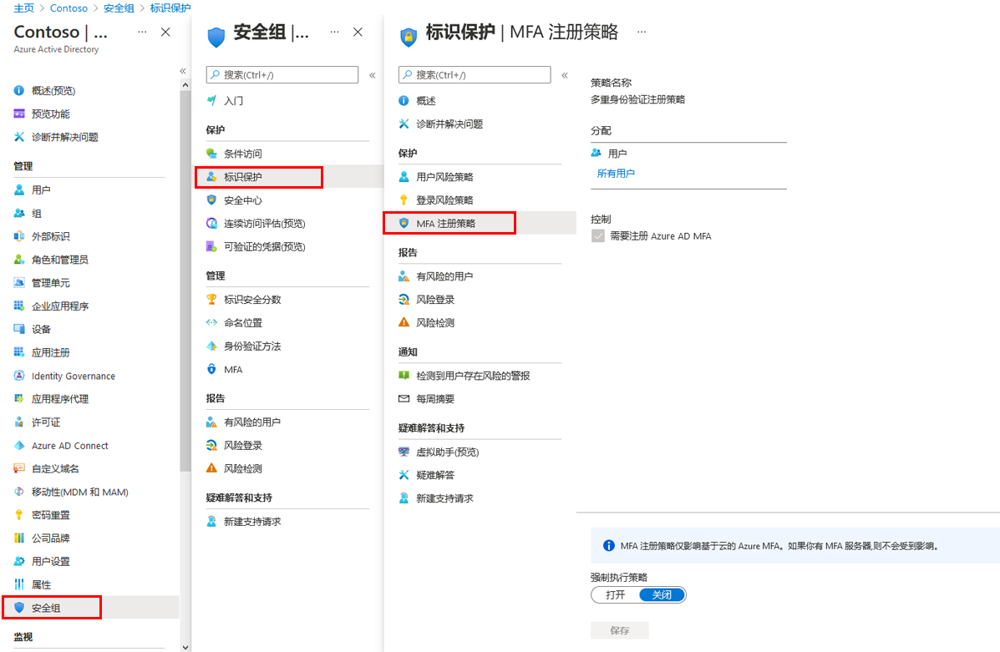

---
lab:
  title: 15 - 配置多重身份验证注册策略
  learning path: '02'
  module: Module 02 - Implement an Authentication and Access Management Solution
---

# 实验室 15 - 配置多重身份验证注册策略

### 登录类型 = Microsoft 365 管理

## 实验室方案

多重身份验证是要求使用多种方式（而不仅仅是用户名和密码）对你的身份进行验证的一种方法。 它为用户登录提供了附加的安全层。用户必须先注册 Microsoft Entra 多重身份验证，然后才能响应 MFA 提示。 你需要将 Microsoft Entra 组织的 MFA 注册策略配置为分配给所有用户。

#### 预计用时：10 分钟

### 练习 1 - 设置 MFA 注册策略

#### 任务 1 - 策略配置

1. 使用全局管理员帐户登录 [https://entra.microsoft.com]( https://entra.microsoft.com)。

2. 打开门户菜单，然后选择“Microsoft Entra ID” ****。

3. 在左侧菜单的“标识”**** 下，选择“保护”****。

4. 在“安全性”页的左侧导航栏中，选择“标识保护”。

5. 在“标识保护”页的左侧导航栏中的“保护”下，选择“多重身份验证注册策略” 。

    

6. 在“分配”下

7. 在“分配”下，选择“所有用户”，查看可用选项。

8. 你可以从“所有用户”中进行选择，如果部署受到限制，则可以“选择个人和组”。

9. 此外，还可以选择从策略中排除用户。

10. 在“控制”下，注意“需要 Microsoft Entra ID 多重身份验证注册”已选中且无法更改。********

#### 任务 2 - 为 MFA 注册配置 Microsoft Entra 标识保护策略

**备注**：Microsoft Entra 标识保护需要激活 Microsoft Entra ID 高级版 P2。 

1. 在 Microsoft Entra 管理中心，导航到搜索栏中的“**Microsoft Entra ID 保护**”。

1. 在菜单中的“保护”**** 下，选择“多重身份验证注册策略”****。

1. 在“分配”下，选择“用户”下的“所有用户”，然后选择一个用户来强制实施 MFA 。

1. 将“**策略强制实施**”更改为“**已启用**”。

1. 选择“保存”。

这将要求用户在下次尝试登录时完成 MFA 注册。

1. 在专用浏览器中，导航到 `https://login.microsoftonline.com`。 输入租户的用户名和密码。  请注意要求用户输入的附加安全信息要求。
