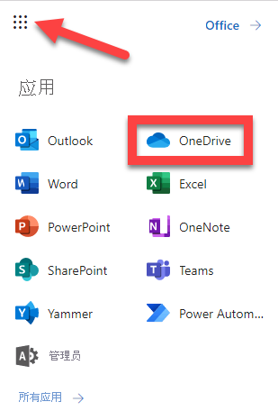

---
lab:
  title: 18 - Microsoft Defender for Cloud Apps 访问策略
  learning path: "03"
  module: Module 03 - Implement Access Management for Apps
ms.openlocfilehash: 96c7c24c45e155c80a6e8c44852fb930c36aa876
ms.sourcegitcommit: 80c5c0ef60c1d74fcc58c034fe6be67623013cc0
ms.translationtype: HT
ms.contentlocale: zh-CN
ms.lasthandoff: 07/01/2022
ms.locfileid: "146823208"
---
# 18 - Microsoft Defender for Cloud Apps 访问和会话策略

## 实验室方案

Microsoft Defender for Cloud Apps 可用于创建特定于要监视的云应用的其他条件访问策略。  可从 Microsoft Defender for Cloud Apps 门户中的“控制”菜单中创建这些策略。

#### 预计用时：20 分钟

### 练习 1 - 创建 Defender for Cloud Apps 访问策略

#### 任务 1 - 将 Azure AD 配置为使用 Defender for Cloud Apps

1. 导航到 [portal.azure.com](portal.azure.com) 并转到 Azure Active Directory。

1. 在“管理”下，选择“安全性”   。

1. 在“保护”下，选择“条件访问”   。

1. 选择“+ 新建策略”下拉列表，然后选择“创建新策略” 。

1. 输入策略名称，例如“Defender for Cloud Apps 控制”。

1. 在“用户或工作负载标识”下，选择“已选择用户或工作负载标识”，然后选择“选择用户和组”和“用户和组”   。

1. 选择实验室租户的管理员用户帐户，然后选择“选择”。

1. 在“云应用或操作”下，选择“未选择云应用、操作或身份验证上下文”。

1. 选择“选择应用”、“Microsoft Cloud App Security”、“Office 365 Exchange Online”和“Office 365”，然后选择“选择”    。 

1. 在“访问控制”下，选择“会话”和“已选择控制”  。

1. 选择“使用条件访问应用控制”框，保留默认值“仅监视”，然后选择“选择”  。

1. 在“启用策略”下，选择“启用”，然后选择“创建”  。

#### 任务 2 - 访问 Microsoft Defender for Cloud Apps 并创建条件访问应用控制

注册应用程序会在应用与 Microsoft 标识平台之间建立信任关系。 信任是单向的：应用信任 Microsoft 标识平台，但标识平台并不信任应用。

1. 使用全局管理员帐户登录 [https://security.microsoft.com](https://security.microsoft.com)。

1. 在左侧菜单中，滚动到底部，然后选择“更多资源”。

1. 在“更多资源”窗口中，找到并选择“Microsoft Defender for Cloud Apps”下的“打开”  。  此时将转到 Microsoft 365 帐户中的“Microsoft Defender for Cloud Apps”门户。

1. 在 Microsoft Defender for Cloud Apps 门户菜单中，选择“控制”的下拉箭头，然后选择“策略”  。

1. 选择“+ 创建策略”。 选择“访问策略”。

1. 输入策略的名称，例如“阻止来自非托管设备的访问”。

1. 将“类别”保留为“访问控制” 。

1. 在“符合以下所有条件的活动”下，选择“符合 Intune 且已加入混合 Azure AD”的下拉菜单，然后取消选择“已加入混合 Azure AD”  。

1. 选择“选择应用”下拉列表。  选择 Microsoft OneDrive for Business。

1. 将“操作”保留为“测试” 。

1. 在“警报”下，选中“创建警报...”并选择“以电子邮件形式发送警报”  。

1. 输入实验室管理员电子邮件地址，然后按 Enter。

1. 选择“创建”以创建访问策略。

1. 在另一个浏览器选项卡上，导航到 <login.microsoftonline.com>，并从页面右上角的应用选择中选择 OneDrive。

    

1. 在 Microsoft Defender for Cloud Apps 中，选择菜单上的“警报” 。  这将使你从策略（内置和自定义）转到警报仪表板。 

1. 在“筛选器”中，选择 OneDrive for Business（位于“应用:  选择应用”下）和创建的策略（位于“策略:选择策略”下）。 此策略的警报将在此处显示。

1. 从 <login.microsoftonline.com> 导航到 Outlook，查看收件箱中有无警报 。 你应会看到“监视对 Mrosoft Exchange Online 的访问”（如果已选择）。 此内容基于实验室提供者提供的条件访问策略。

   注意 - 此策略生效并提供警报可能存在一定的延迟。
