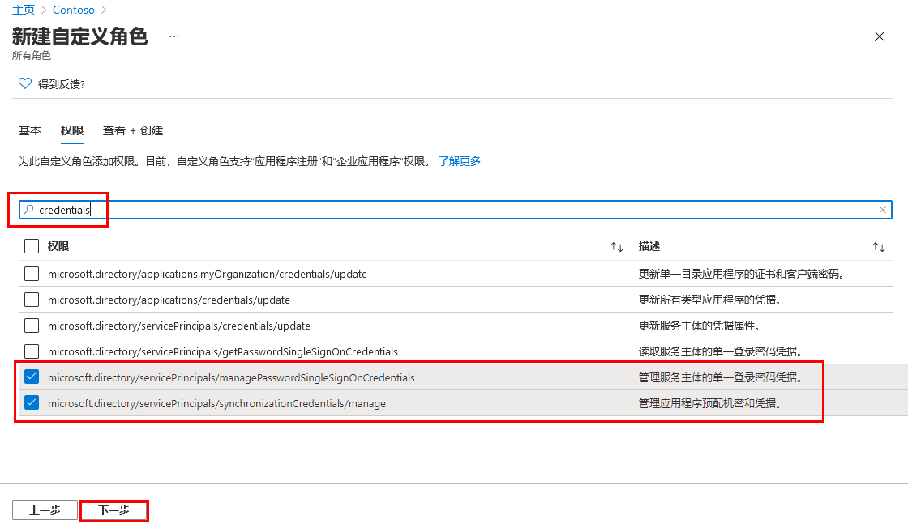

---
lab:
  title: 19 - 注册应用程序
  learning path: '03'
  module: Module 03 - Implement Access Management for Apps
---

# 实验室 19 - 注册应用程序

### 登录类型 = Microsoft 365 管理

#### 预计用时：30 分钟

### 练习 1 - 注册应用程序

#### 任务 1 - 应用注册

注册应用程序会在应用与 Microsoft 标识平台之间建立信任关系。 信任是单向的：应用信任 Microsoft 标识平台，但标识平台并不信任应用。

1. 使用提供的管理员帐户登录[https://entra.microsoft.com](https://entra.microsoft.com) 。

2. 打开门户菜单，然后选择“Microsoft Entra ID” ****。

3. 在“标识”菜单上的“应用程序”下，选择“应用注册”。************

4. 在“应用注册”页面上的菜单中，选择“+新建注册”。

5. 在“注册应用程序”边栏选项卡上，使用默认值注册一个名为“演示应用”的应用。 无需输入重定向 URI。

    

6. 选择**注册**按钮。

7. 完成后，你将定向到“演示应用”**** 页。

#### 任务 2 - 配置平台设置

在 Azure 门户的“平台配置”中配置每种应用程序类型的设置（包括重定向 URI） ****  。 某些平台（例如 Web 和单页应用程序）要求手动指定重定向 URI ****   **** 。 对于其他平台（例如移动和桌面），可选择在配置其他设置时为用户生成的重定向 URI。

若要根据面向的平台或设备配置应用程序设置：

配置已注册的应用程序的平台设置来添加和修改它的重定向 URI。

1. 在 Microsoft Entra 管理中心的“应用注册” **** 中选择你的应用程序。

2. 在“管理”下选择“身份验证” ****  **** 。

3. 在“平台配置”下，选择“+ 添加平台” ****  **** 。

4. 在“配置平台”中，为应用程序类型（平台）选择磁贴，以配置其设置 **** 。

    

    | 平台| 配置设置|
    | :--- | :--- |
    | Web| 输入应用的重定向 URI，即 Microsoft 标识平台重定向用户客户端并在身份验证后发送安全令牌的位置 ****  。 为服务器上运行的标准 Web 应用程序选择此平台。|
    | 单页应用程序| 输入应用的重定向 URI，即 Microsoft 标识平台重定向用户客户端并在身份验证后发送安全令牌的位置 ****  。 如果要在 JavaScript 中或使用 Angular、Vue.js、React.js 或 Blazor WebAssembly 等框架构建客户端 Web 应用，请选择此平台。|
    | iOS/macOS| 输入应用捆绑 ID，可在 info.plist 中的 XCode 或生成设置中找到该 ID ****  **  。 如果指定捆绑 ID，将生成重定向 URI。|
    | Android| 输入应用包名称（可在 AndroidManifest.xml 文件中找到），然后生成并输入签名哈希 ****  **** 。 如果指定这些设置，将生成重定向 URI。|
    | 移动和桌面应用程序| 选择建议的重定向 URI 之一，或指定自定义重定向 URI ****   **** 。 对于桌面应用程序，建议：[https://login.microsoftonline.com/common/oauth2/nativeclient](https://login.microsoftonline.com/common/oauth2/nativeclient)。 对于不使用最新 Microsoft 身份验证库 (MSAL) 或不使用代理的移动应用程序，请选择此平台。 同时也为桌面应用程序选择此平台。|

5. 选择“**Web**”作为平台。

6. 输入`https://localhost` 作为“重定向 URI”。

7. 选择“配置”以完成平台配置 ****  。

#### 任务 3 - 添加凭据、证书和客户端密码

凭据供访问 Web API 的机密客户端应用程序使用。 Web 应用、其他 Web API、服务类型的应用程序和守护程序类型的应用程序都是机密客户端。 通过凭据，应用程序可以自己的身份进行身份验证，无需用户在运行时进行任何交互。

可将证书和客户端密码（字符串）作为凭据添加到机密客户端应用注册。


    **Note**: Sometimes called a *public key*, certificates are the recommended credential type, because as they provide a higher level of assurance than a client secret. When using a trusted public certificate, you can add the certificate using the Certificates & secrets feature. Your certificate must be one of the following file types: .cer, .pem, .crt.


    **Note**: The client secret, also known as an *application password*, is a string value your app can use in place of a certificate to identity itself. It's the easier of the two credential types to use. It's often used during development, but is considered less secure than a certificate. You should use certificates in your applications running in production.

1. 在 Azure 门户的“应用注册”中选择你的应用程序 ****  。

2. 选择“证书和密码”，然后选择“+ 新建客户端密码” ****  **** 。

3. 添加客户端密码和持续时间的说明

 - 说明 = SC300 实验室机密
 - 持续时间 = 90 天（3 个月）

4. 选择“添加” ****。

5. 在记事本中记下密码的值，以供在客户端应用程序代码中使用；“证书和机密”页面将显示新密码值 。 复制此值非常重要，因为它只显示一次；如果刷新页面再返回，则它只会显示为掩码值。

注册 Web API 后，便可以添加范围，API 的代码可使用这些范围向 API 的使用者提供精细权限。

#### 任务 5 - 添加范围

客户端应用程序中的代码通过将访问令牌及其请求传递到受保护的资源 (Web API) 来请求执行由 Web API 定义的操作的权限。 然后，仅当 Web API 接收的访问令牌包含操作所需的范围（也称为应用程序权限）时，该 API 才会执行请求的操作。

首先，请按照以下步骤创建一个名为 Employees.Read.All 的示例范围：

1. 依次选择“ **标识**”、“**应用程序**” 、“ **应用注册**”，最后选择 API 的应用注册。

2. 依次选择“公开 API”、“+ 添加范围” ****  **** 。

    

3. 系统会提示设置 **应用程序 ID URI**。 将值设置为 **api://DemoAppAPI**

  - 备注 - 应用 ID URI 充当将在 API 代码中引用的范围的前缀，它必须是全局唯一的。 可使用提供的默认值（格式为 api://<application-client-id\>），或者指定一个可读性更强的 URI，例如 `https://contoso.com/api`。

4. 选择“保存并继续”。

5. 接下来，在“添加范围”窗格中指定范围的属性 **** 。 对于此演练，请使用第三列中的值 - **值**。

    | 字段| 说明| 值 |
    | :--- | :--- | :--- |
    | 范围名称| 范围的名称。 公共范围命名约束为 resource.operation.constraint。| Employees.Read.All|
    | 谁可以许可| 此范围是由用户同意，还是由管理员同意。 若要获得更高特权，请选择“仅管理员”。| 管理员和用户|
    | 管理员许可显示名称| 仅管理员可以看到的范围用途的简短说明。| 对员工记录的只读访问权限|
    | 管理员许可说明| 仅管理员可以看到的范围所授予权限的更详细说明。| 允许应用程序对所有员工数据进行只读访问。|
    | 用户许可显示名称| 范围用途的简短说明。 仅当你将“谁可以同意”设置为“管理员和用户”时才向用户显示 。| 对员工记录的只读访问权限|
    | 用户同意说明| 范围所授予权限的更详细说明。 仅当你将“谁可以同意”设置为“管理员和用户”时才向用户显示 。| 允许应用程序对员工数据进行只读访问。|

7. 将“状态”设置为“启用”，然后选择“添加范围” ****   ****  **** 。

8. （可选）若要取消向应用用户提示同意你定义的范围，可以“预授权”客户端应用程序访问 Web API **  。 请仅预授权所信任的客户端应用程序，因为用户不会有机会拒绝同意 **  。

   1. 在“授权的客户端应用程序”下，选择“添加客户端应用程序” ****  **** 。

   2. 输入要预授权的客户端应用程序的“应用程序(客户端) ID” ****  。 例如，以前注册的 Web 应用程序的 ID。

   3. 在“授权范围”下，选择要取消显示同意提示的范围，然后选择“添加应用程序” ****  **** 。

   4. 如果按照此可选步骤操作，客户端应用现在就是一个预授权的客户端应用 (PCA)；当用户登录它时，系统将不提示用户授予同意。

#### 任务 6 - 添加需要管理员同意的范围

接下来，再添加一个名为 Employees.Write.All 的示例范围，只有管理员才能同意该范围。 需要管理员同意的范围通常用于提供对更高特权的操作的访问权限，通常由作为后端服务运行的客户端应用程序或不以交互方式登录用户的后台程序使用。

1. 若要添加 Employees.Write.All 示例范围，请按照上述步骤操作，在“添加范围”窗格中指定以下值 ****  ：

    | 字段| 示例值|
    | :--- | :--- |
    | 作用域名| Employees.Write.All|
    | 谁可以许可| 仅管理员|
    | 管理员许可显示名称| 对员工记录的写入访问权限|
    | 管理员许可说明| 允许应用程序对所有员工数据进行写入访问。|
    | 用户许可显示名称| 无（留空）|
    | 用户同意说明| 无（留空）|

2. 确保将“状态”设置为“**启用**”，然后选择“**添加范围**”。

  - 注意：如果你已成功添加先前部分中所介绍的两个示例范围，则它们将显示在 Web API 的应用注册的“公开 API”窗格中，类似于以下内容 ****  ：

  

  如图所示，范围的完整字符串由 Web API 的“应用程序 ID URI”与范围的“范围名称”串联而成 ****   **** 。

  注意：例如，如果 Web API 的应用程序 ID URI 为  `https://contoso.com/api`，范围名称为 Employees.Read.All，则完整范围为：`https://contoso.com/api/Employees.Read.All` 

  **注意**：接下来，你将按照上述步骤配置客户端应用的注册，其中包含对 Web API 的访问权限和你所定义的范围。
  向客户端应用注册授予访问 Web API 的权限后，Microsoft 标识平台可以向客户端颁发 OAuth 2.0 访问令牌。 当客户端调用 Web API 时，它会提供一个访问令牌，令牌的范围 (scp) 声明设置为你在客户端的应用注册中所指定的权限。 以后可以根据需要公开其他范围。 请考虑 Web API 可以公开与多个操作关联的多个范围。 在运行时，资源可通过评估其收到的 OAuth 2.0 访问令牌中的范围 (scp) 声明，来控制对 Web API 的访问。


### 练习 2 - 使用自定义角色管理应用注册

#### 任务 1 - 创建新的自定义角色以授予管理应用注册的访问权限

你需要为应用管理创建新的自定义角色。 此新角色只应具有执行凭据管理所需的特定权限。

1. 使用全局管理员帐户登录  [https://entra.microsoft.com](https://entra.microsoft.com)  。

2. 打开门户菜单，然后选择“Microsoft Entra ID” ****。

3. 在左侧菜单的“**标识**”下，选择“**角色和管理员**”。

4. 选择“角色和管理员”**** 项，然后选择“+ 新建自定义角色”****。

    

5. 在“新建自定义角色”对话框的“基本信息”标签页的“名称”框中，输入“我的自定义应用角色”****。

6. 查看其余选项，然后选择“下一步”。

7. 在“权限”选项卡上，查看可用权限。

8. 在“按权限名称或说明搜索”框中，输入“凭据” 。

9. 在结果中选择“管理”权限，然后选择“下一步”。

    ```
       microsoft.directory/servicePrincipals/managePasswordSingleSignOnCredentials  -   Manage password single sign-on credentials or service principals.
       microsoft.directory/servicePrincipals/synchronizationCredentials/manage    -   Manage application provisioning secrets and credentials.
    ```

    

    **为什么选择这两项**：对于应用程序预配来说，这两项是为正在创建的应用程序或服务主体启用和强制执行单一登录，并且能够将企业应用程序分配给一组用户或组所需的最低权限。  也可以授予其他权限。  可在以下位置获取完整的可用权限列表：`https://docs.microsoft.com/azure/active-directory/roles/custom-enterprise-app-permissions`。

10. 选择**下一步**。

11. 查看更改，然后选择“创建”。

