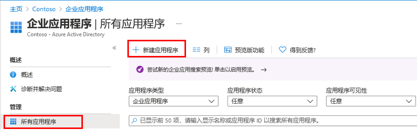
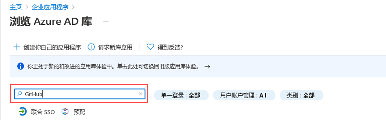
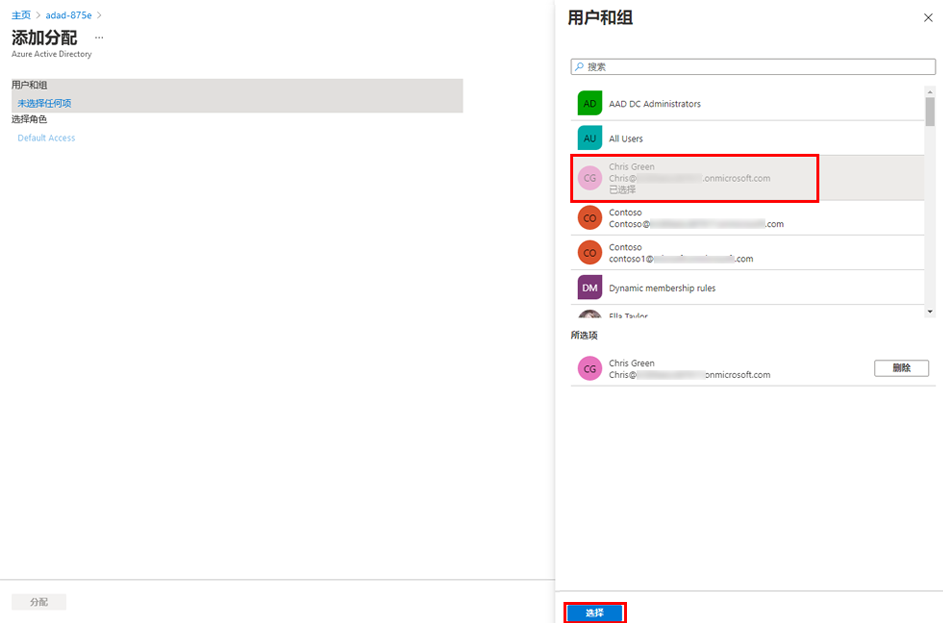

---
lab:
  title: 20 - 实现应用的访问管理
  learning path: "03"
  module: Module 03 - Implement Access Management for Apps
ms.openlocfilehash: f8d53310a4d18df9e7ec184b0507024f207eaadd
ms.sourcegitcommit: b5fc07c53b5663eaa1883cf38b70c57cd88470ca
ms.translationtype: HT
ms.contentlocale: zh-CN
ms.lasthandoff: 06/29/2022
ms.locfileid: "146741386"
---
# 实验室 20 - 实现应用的访问管理

## 实验室方案

你的组织要求仅特定用户或组有权访问企业应用程序。 你需要将用户分配到特定应用程序。

#### 预计用时：5 分钟

### 练习 1 - 配置企业应用

#### 任务 1 - 将应用添加到 Azure AD 租户

1. 使用全局管理员帐户登录到 [https://portal.azure.com](https://portal.azure.com)。

2. 打开门户菜单，然后选择“Azure Active Directory”。

3. 在“Azure Active Directory”页的“管理”下，选择“企业应用程序” 。

4. 在“企业应用程序”窗格中，选择“+ 新建应用程序”。

    

5. 在“浏览 Azure AD 库(预览)”页的“搜索应用程序”框中，输入“GitHub” 。

    

6. 在结果中，选择“GitHub Enterprise Cloud – 企业帐户”。

7. 在“GitHub Enterprise Cloud – 企业帐户”中，检查设置，然后选择“创建”。

8. 创建帐户后，你将被重定向到“GitHub Enterprise Cloud – 企业帐户”页。

#### 任务 2 - 向应用分配用户

1. 在“GitHub Enterprise Cloud - 企业帐户”页的“概述”页面的“开始”下，选择“1. 分配用户和组”。

2. 或者，可以在左侧导航的“管理”下，选择“用户和组”。

3. 在“用户和组”页面的菜单上，选择“+ 添加用户/组”。

4. 在“添加分配”页上，选择“用户和组”。

5. 在“用户和组”窗格中，选择管理员帐户，然后选择“选择”。

    

6. 选择“分配”。

