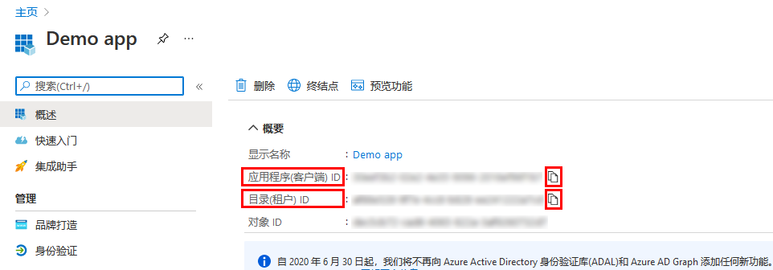
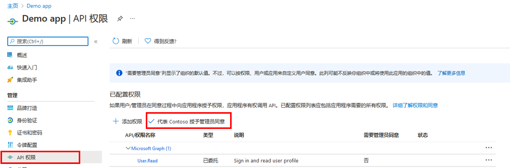
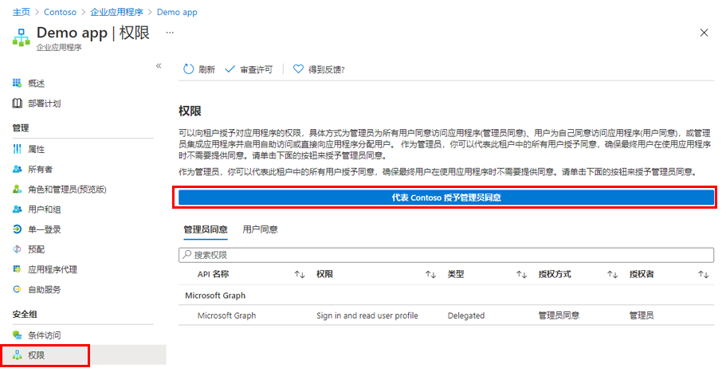

---
lab:
  title: 21 - 向应用程序授予整个租户的管理员同意
  learning path: "03"
  module: Module 03 - Implement Access Management for Apps
ms.openlocfilehash: 6618f481c5e25496aef4c5b688976dde9d74cffa
ms.sourcegitcommit: 80c5c0ef60c1d74fcc58c034fe6be67623013cc0
ms.translationtype: HT
ms.contentlocale: zh-CN
ms.lasthandoff: 07/01/2022
ms.locfileid: "146823229"
---
# 实验室 21：向应用程序授予整个租户的管理员同意

## 实验室方案

对于组织开发的应用程序，或者已直接在 Azure AD 租户中注册的应用程序，可通过 Azure 门户中的“应用注册”授予租户范围的管理员同意。

#### 预计用时：15 分钟

### 练习 1 - 管理员同意

#### 任务 1 - 在应用注册中授予管理员同意

   警告 - 向某个应用程序授予租户范围的管理员同意将为该应用及其发布者授予对组织数据的访问权限。 在授予许可之前，请仔细查看应用程序请求的权限。

若要为 Microsoft Graph API 应用程序权限提供管理员许可，需要“全局管理员”角色。

1. 在上一练习中，你创建了一个名为“演示应用”的应用。 如有必要，请在 Microsoft Azure 中，浏览到“Azure Active Directory”，然后依次选择“应用注册”和“演示应用”  。

2. 在“演示应用”页上，找到并复制保存每个应用程序（客户端）ID 和目录（租户）ID，以便稍后可使用  。

    >**注意**：演示应用是在上一个实验室中创建的。 请在本实验室之前完成这些实验室。

    

3. 在左侧导航栏中，在“管理”下选择“API 权限”。

4. 在“已配置权限”下，选择“授予管理员同意”。

    

5. 查看对话框，然后选择“是”。

   警告 - 通过“应用注册”授予租户范围的管理员同意将撤销先前已授予的租户范围的所有权限。 之前用户自己授予的权限将不受影响。

#### 任务 2 - 在企业应用中授予管理员同意

如果应用程序已在租户中预配，则你可以通过“企业应用程序”授予租户范围的管理员许可。

1. 在 Microsoft Azure 中，浏览到“Azure Active Directory”>“企业应用程序”>“演示应用”。

2. 在“演示应用”页的左侧导航栏中，在“安全性”下选择“权限”  。

3. 在“权限”下，选择“授予管理员同意”。

    

   警告 - 通过“应用注册”授予租户范围的管理员同意将撤销先前已授予的租户范围的所有权限。 之前用户自己授予的权限将不受影响。

4. 出现提示时，使用全局管理员帐户登录。

5. 在“请求的权限”对话框中，查看信息，然后选择“权限”。

### 练习 2 - Azure AD Identity Governance 设置

#### 任务 1 - 使用 Azure AD Identity Governance 设置来管理外部用户的生命周期

你可以选择当外部用户（已通过正在审批的访问包请求邀请到你的目录的用户）不再有任何访问包分配时将发生什么情况。 如果用户放弃其所有访问包分配，或者其最后一个访问包分配过期，则可能会发生这种情况。 默认情况下，当外部用户不再有任何访问包分配时，系统会阻止其登录到你的目录。 30 天后，系统会从你的目录中删除外部用户的来宾用户帐户。

1. 以全局管理员身份登录 [https://portal.azure.com](https://portal.azure.com)。

2. 具有全局管理员或用户管理员角色的帐户才能完成这些任务。

3. 打开 Azure Active Directory，然后选择“Identity Governance”。

4. 在左侧导航菜单的“权利管理”下，选择“设置”。

5. 在顶部菜单中，选择“编辑”。

    

6. 在“管理外部用户的生命周期”部分中，查看外部用户的其他设置。

7. 当外部用户失去其对任何访问包的最后一个分配时，如果想要阻止其登录到此目录，请将“阻止外部用户登录到此目录”设置为“是”。

    注意 - 如果阻止用户登录到目录，则用户将无法在此目录中重新请求访问包或请求其他访问权限。 如果用户以后需要请求访问其他访问包，请不要通过配置阻止其登录。

9. 当外部用户失去其对任何访问包的最后一个分配时，如果想要删除其在此目录中的来宾用户帐户，请将“删除外部用户”设置为“是”。

    备注 - 使用“权利管理”，仅可删除通过“权利管理”邀请的帐户。 另请注意，系统会阻止用户登录并从此目录中删除用户，即使已将该用户添加到此目录中不是访问包分配的资源。 如果来宾在接收访问包分配之前已存在于此目录中，则会将其保留。 但是，如果是通过访问包分配邀请的来宾，并且在邀请之后还将其分配给了 OneDrive for Business 或 SharePoint Online 站点，则仍会将其删除。

10. 如果要删除此目录中的来宾用户帐户，可以设置一个天数，该天数过后即可将其删除。 如果要在来宾用户帐户丢失其对任何访问包的最后一个分配时立即将其删除，请将“从此目录中删除外部用户之前需等待的天数”设置为“0”。 

11. 如果进行了任何更改，请选择“保存”。
