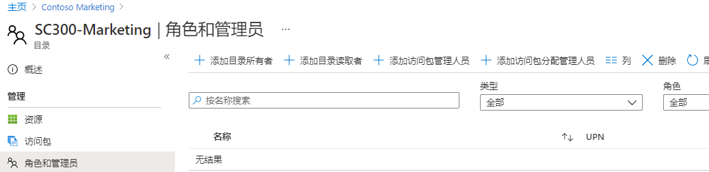

---
lab:
  title: 22 - 在 Azure AD 权利管理中创建和管理资源目录
  learning path: '04'
  module: Module 04 - Plan and Implement and Identity Governance Strategy
---

# 实验室 22：在 Azure AD 权利管理中创建和管理资源目录

## 实验室方案

目录是资源和访问包的容器。 需要将相关的资源和访问包分组时，可以创建目录。 创建目录的任何人将成为第一个目录所有者。 目录所有者可以添加其他目录所有者。 你需要在组织中创建并配置目录。

#### 预计用时：15 分钟

### 练习 1 - 在权利管理中构建资源

#### 任务 1 - 创建目录

1. 使用全局管理员帐户登录 [https://portal.azure.com](https://portal.azure.com)。

    重要说明 - 若要使用和配置 Azure AD 使用条款，必须具备以下先决条件：
    - Azure AD Premium P1、P2、EMS E3 或 EMS E5 订阅。
    - 如果你没有这些订阅，可获取 Azure AD Premium 订阅或启用 Azure AD Premium 试用版订阅。
    - 下述适用于需配置目录的管理员帐户之一：
        - 全局管理员角色
        - 安全管理员
        - 条件访问管理员

2. 打开 Azure Active Directory，然后选择“Identity Governance” **** 。

3. 在左侧菜单的“权利管理”下，选择“目录”。

4. 在顶部菜单中选择“+ 新建策略”。

    

5. 在“新建目录”窗格的“名称”框中，输入“市场营销”。

6. 在“说明”框中，输入“面向市场营销部门用户”。 用户将在访问包的详细信息中看到此信息。

7. 在“启用”下，选择“否”。

- - 为外部用户启用”选项使所选外部目录中的用户可以在此目录中请求访问包。 不会对此设置进行任何更改。

9. 可选择启用目录以立即使用，如果打算暂存该目录，则在打算使用之前，可选择将其禁用或使其不可用。 对于本练习，无需启用目录。

    

10. 选择“创建”。

#### 任务 2 - 将资源添加到目录

若要在访问包中包含资源，这些资源必须存在于目录中。 可添加的资源类型包括组、应用程序和 SharePoint Online 站点。 组可以是云创建的 Microsoft 365 组，或者云创建的 Azure AD 安全组。 应用程序可以是 Azure AD 企业应用程序，包括 SaaS 应用程序，以及你自己的已联合到 Azure AD 的应用程序。 站点可以是 SharePoint Online 站点或 SharePoint Online 站点集合。

1. 如有必要，在“Identity Governance”页上选择“目录”。

2. 在“目录”列表中，选择“市场营销”。

3. 在左侧导航栏的“管理”下，选择“资源”。

4. 在菜单上，选择“+ 添加资源”。

5. 在“向目录添加资源”页上查看可用选项。  添加以下项：

   | 资源类型 | 值 |
   | :------------- | :---------- |
   |  组和团队 | Retail |
   |  **应用程序** | Box |
   |  **应用程序** | Salesforce |
   |  **SharePoint 站点** | 品牌 SharePoint <<< 从可用 SharePoint 网站列表中选择 |

6. 你可能在组和团队、应用程序或 SharePoint 站点中没有任何资源。 选择任何资源类别，然后从该类别中选择一个资源。

7. 对于本练习，可选择任何可用的资源。

    

8. 完成后，选择“添加”。 现在，可将这些资源包含在目录中的访问包内。

#### 任务 3 - 添加其他目录所有者

创建了目录的用户将成为第一个目录所有者。 若要委托目录的管理，请将用户添加到目录所有者角色。 这有助于共享目录管理责任。

1. 如有必要，请在 Azure 门户中浏览到“Azure Active Directory”，然后依次选择“Identity Governance”、“目录”和“市场营销”。   

2. 在“营销目录”页的左侧导航菜单中，选择“角色和管理员”。

    

3. 在顶部菜单中，查看可用的角色，然后选择“+ 添加目录所有者”。

4. 在“选择成员”窗格中，选择“Adele Vance”，然后选择“选择” 。

5. 查看“角色和管理员”列表中新添加的角色。

#### 任务 4 - 编辑目录

可以编辑目录的名称和说明。 用户将在访问包的详细信息中看到此信息。

1. 在“市场营销”页的左侧导航栏中，选择“概述”。

2. 在顶部菜单中，选择“编辑”。

3. 查看设置，然后在“属性” > “启用”下选择“是”。

    

4. 选择“保存”。

#### 任务 5 - 为来宾用户创建访问评审

1. 访问评审可以管理访问生命周期。Azure AD Identity Governance 提供一个概述仪表板，其中显示了访问评审的状态。 在“Identity Governance”菜单中选择“访问评审” 。

1. 在“访问评审”菜单下，可以选择“访问评审”，为来宾用户配置访问评审。选择“+ 新建访问评审”以创建来宾用户访问评审。磁贴随即打开，可为来宾用户配置访问评审。

1. 为“选择要评审的内容”选择“团队 + 组” 。

1. 在“选择评审范围”下，选择“所有包含来宾用户的 Microsoft 365 组” 

1. 在“选择用户范围”下，选择“仅限来宾用户” 。

1. 选择“下一步: 评审”。

1. 可在下一个磁贴中配置评审和批准访问权限的人员、评审访问权限的频率以及访问权限何时到期。

1. 在“选择审阅者”下，选择“组所有者”作为这些审阅者 。 **注意**：不应允许来宾用户评审自己的访问权限，这是一种良好的标识治理实践。

1. 输入“持续时间(以天为单位)”，默认值为 3，选择“评审周期”和“开始日期”以进行评审  。

1. 选择“下一页:**设置”并配置有关如何进行评审以及来宾用户响应或不响应时会发生什么情况的设置**。  一个良好做法是选择“自动将结果应用于资源”，并为“如果审阅者未响应”选择“删除访问权限”  。 

1. 选择“下一页:**查看 + 创建”，然后选择“创建”以创建新的“代码评审”**  。

#### 任务 6 - 删除目录

可以删除目录，但前提是它不包含任何访问包。

1. 在“市场营销”目录的“概述”页的顶部菜单中，选择“删除”。

2. 在“删除”对话框中，查看信息，然后选择“否”。

    备注 - 我们将保留目录以供下一个实验室使用。
