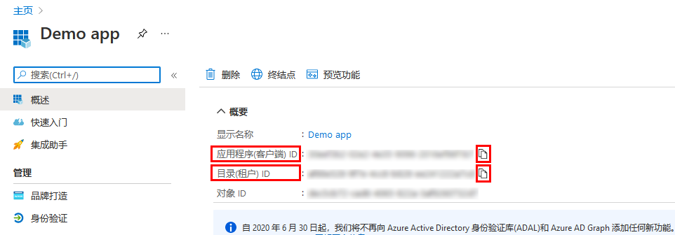
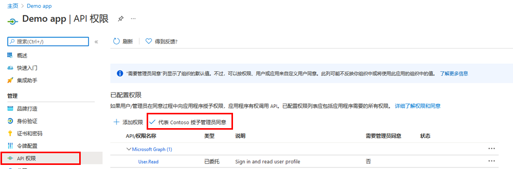
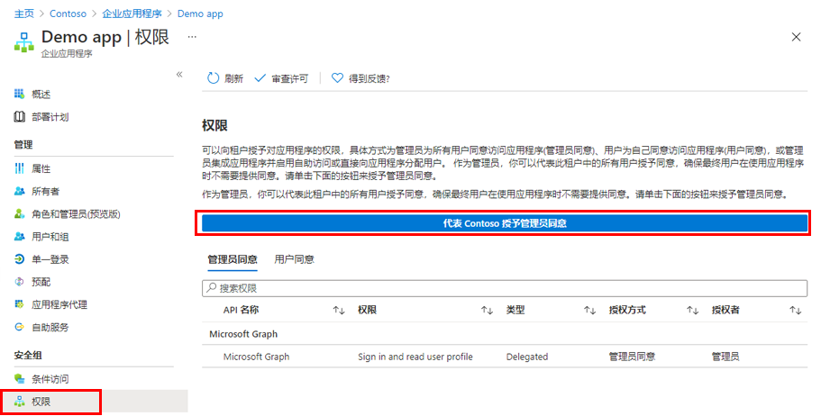

---
lab:
  title: 23 - 向应用程序授予租户范围的管理员同意
  learning path: "03"
  module: Module 03 - Implement Access Management for Apps
ms.openlocfilehash: 0f643be480269183e30f1a8ce335520d75bea31a
ms.sourcegitcommit: 448f935ad266989a6f0086019e0c0e0785ad162b
ms.translationtype: HT
ms.contentlocale: zh-CN
ms.lasthandoff: 02/10/2022
ms.locfileid: "138421426"
---
# 实验室 23：向应用程序授予整个租户的管理员同意

## 实验室方案

对于组织开发的应用程序，或者已直接在 Azure AD 租户中注册的应用程序，可通过 Azure 门户中的“应用注册”授予租户范围的管理员同意。

#### 预计用时：10 分钟

### 练习 1 - 管理员同意

#### 任务 1 - 在应用注册中授予管理员同意

   警告 - 向某个应用程序授予租户范围的管理员同意将为该应用及其发布者授予对组织数据的访问权限。 在授予许可之前，请仔细查看应用程序请求的权限。

若要为 Microsoft Graph API 应用程序权限提供管理员许可，需要“全局管理员”角色。

1. 在上一练习中，你创建了一个名为“演示应用”的应用。 如有必要，请在 Microsoft Azure 中，浏览到“Azure Active Directory”>“应用注册”>“演示应用”。

2. 在“演示应用”边栏选项卡上，找到并复制保存每个应用程序（客户端）ID 和目录（租户）ID，以便稍后可使用。

    

3. 在左侧导航栏中，在“管理”下选择“API 权限”。

4. 在“已配置权限”下，选择“授予管理员同意”。

    

5. 查看对话框，然后选择“是”。

   警告 - 通过“应用注册”授予租户范围的管理员同意将撤销先前已授予的租户范围的所有权限。 之前用户自己授予的权限将不受影响。

#### 任务 2 - 在企业应用中授予管理员同意

如果应用程序已在租户中预配，则你可以通过“企业应用程序”授予租户范围的管理员许可。

1. 在 Microsoft Azure 中，浏览到“Azure Active Directory”>“企业应用程序”>“演示应用”。

2. 在“演示应用”边栏选项卡的左侧导航栏中，在“安全性”下选择“权限”。

3. 在“权限”下，选择“授予管理员同意”。

    

   警告 - 通过“应用注册”授予租户范围的管理员同意将撤销先前已授予的租户范围的所有权限。 之前用户自己授予的权限将不受影响。

4. 出现提示时，使用全局管理员帐户登录。

5. 在“请求的权限”对话框中，查看信息，然后选择“权限”。
