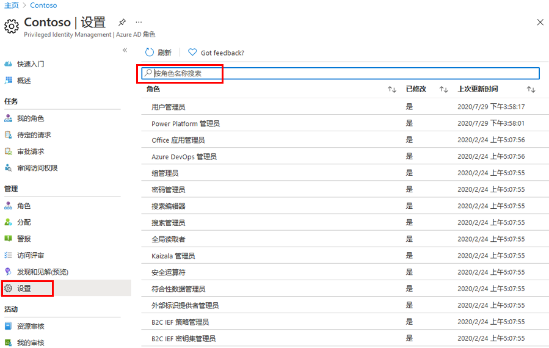
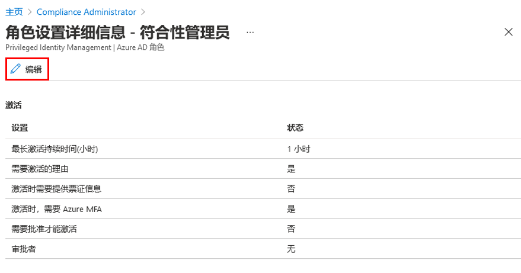
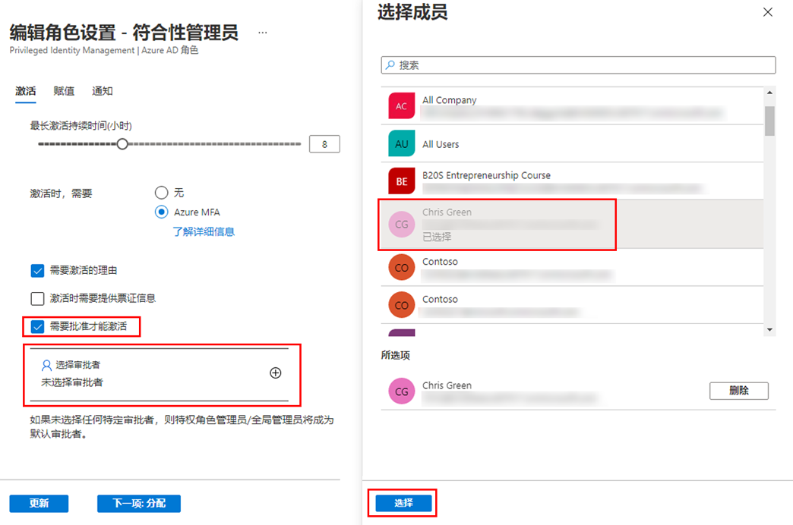

---
lab:
  title: 28 - 针对 Azure AD 角色配置 Privileged Identity Management
  learning path: "04"
  module: Module 04 - Plan and Implement and Identity Governance Strategy
ms.openlocfilehash: 533faf01ba4aab1bd40c76cb9e787c8a731be0ac
ms.sourcegitcommit: 448f935ad266989a6f0086019e0c0e0785ad162b
ms.translationtype: HT
ms.contentlocale: zh-CN
ms.lasthandoff: 02/10/2022
ms.locfileid: "138421315"
---
# 实验室 28：针对 Azure AD 角色配置 Privileged Identity Management

## 实验室方案

特权角色管理员可以在其 Azure Active Directory (Azure AD) 组织中自定义 Privileged Identity Management (PIM)，包括更改激活合格角色分配的用户的体验。 你需要熟悉如何配置 PIM。

#### 预计用时：15 分钟

### 练习 1 - 配置 Azure AD 角色设置

#### 任务 1 - 打开角色设置

遵循以下步骤打开 Azure AD 角色的设置。

1. 以全局管理员身份登录 [https://portal.azure.com](https://portal.azure.com)。

2. 搜索并选择“Azure AD Privileged Identity Management”。

3. 在“Privileged Identity Management”边栏选项卡中，在左侧导航窗格中选择“Azure AD 角色”。

4. 在“快速启动”页的左侧导航窗格中，选择“设置”。

    

5. 查看角色列表，然后在“按角色名称搜索”中输入“合规性”。

6. 在结果中，选择“合规性管理员”。

7. 查看角色设置详细信息。

#### 任务 2 - 需要批准才能激活

如果设置多个审批者，则审批会在其中一项批准或拒绝后立即完成。 不能要求获得至少两位用户的批准。 若要求批准以激活角色，请按照以下步骤操作。

1. 在“角色设置详细信息”页的顶部菜单中，选择“编辑”。

    

2. 在“编辑角色设置 - 合规性管理员”边栏选项卡中，选中“需要批准才能激活”复选框。

3. 选择“选择审批者”。

4. 在“选择成员”窗格中，选择你的管理员帐户，然后选择“选择”。

    

5. 配置角色设置后，选择“更新”以保存更改。
